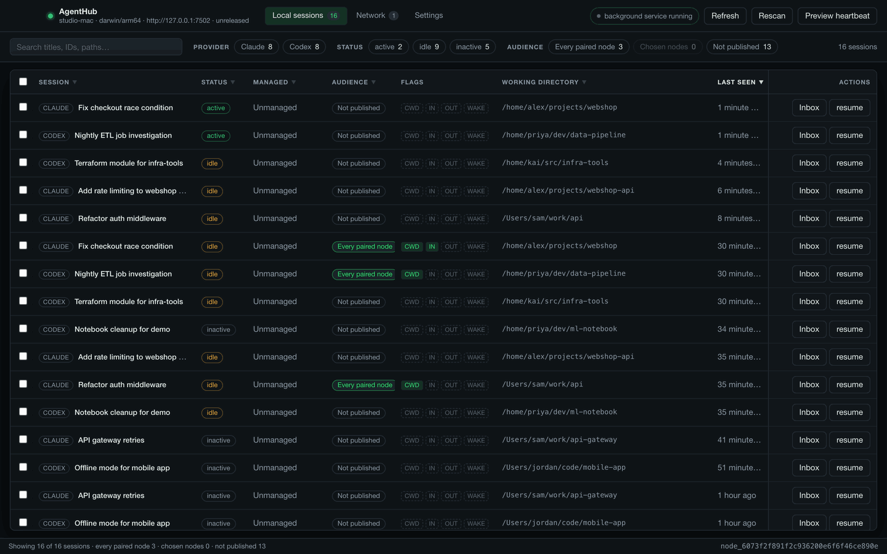
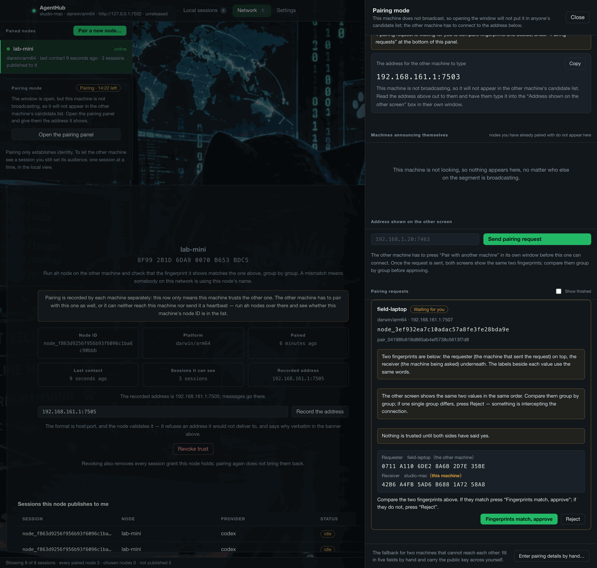

# AgentHub

**One window for every Claude Code and Codex session you have running, on all of
your machines.**

See who is waiting on you, message a session on another computer, and wake it —
nothing leaves your LAN, and there is no account.

Cross-provider (Claude Code and Codex). Cross-machine (paired over your own
network, TLS pinned to keys you compared by fingerprint, on both screens).
Private by default (every session it finds starts invisible; you choose what
each peer sees). No cloud, no account, no telemetry. Written in Go, open source
under the MIT license.





The window is in English and 繁體中文.

## What it does

- **Sees every agent session on every machine you pair.** Claude Code and Codex,
  a mac and a Linux box, one list.
- **Tells you who is waiting.** Each session is `active`, `idle`, `inactive` or
  `unknown`, inferred from the provider's own files — nothing is injected into
  the agent.
- **Lets you message a session on another machine**, and **wake it**, if you
  turn on two switches: the message starts a turn with nobody at the keyboard.
- **Gives every session its own audience.** A session is published to nobody, to
  every paired node, or to the nodes you name. The working directory, incoming
  messages and outgoing messages are three more switches, all closed by default.
- **Hands your agents four MCP tools** — `agent_list`, `agent_status`,
  `agent_inbox`, `agent_send` — so an agent on one machine can ask what an agent
  on another is doing, and write to it.
- **Keeps everything on your LAN.** Peers talk directly to each other over TLS
  pinned to the key recorded at pairing. There is no server in the middle, no
  account, and nothing to sign up for.
- **Never writes into a provider's files or process.** Messages live in
  AgentHub's own SQLite database; handing one to an agent goes through that
  provider's own API, or not at all.

## Install

**macOS and Linux, one line:**

```sh
curl -fsSL https://raw.githubusercontent.com/SheldonChangL/agenthub/main/install.sh | sh
```

It downloads the one release asset for your machine, checks it against that
release's own `SHA256SUMS` before unpacking anything, puts the app in
`/Applications` (or `~/Applications`) or `~/.local/share/agenthub`, links `ah`
into `~/.local/bin`, and registers the background node. When a node is already
registered it reads the unit first and keeps that node's `--db`, so an upgrade
is an upgrade and not a new, empty database — it says `keeping the node's
database at <path>` when it does. It never uses `sudo` and never asks for a
password; `docs/install-script.md` lists every path it writes, every flag it
takes — `--cli-only`, `--no-service`, `--version vX.Y.Z` — and `--dry-run`,
which prints what it would do and does none of it. Flags go after `sh -s --`
when the script arrives through a pipe:

```sh
curl -fsSL https://raw.githubusercontent.com/SheldonChangL/agenthub/main/install.sh | sh -s -- --no-service
```

When it finishes it prints what it installed and where, whether the node is
running, and the one thing to do next: open `agenthub-desktop` from
Applications, which starts on a setup checklist. Uneasy about piping a script
into a shell? Read it first:
`curl -fsSL https://raw.githubusercontent.com/SheldonChangL/agenthub/main/install.sh | less`.

Windows has its own installer; see below. The manual downloads still work
everywhere, and are what the rest of this section describes.

Downloads are on the
[Releases page](https://github.com/SheldonChangL/agenthub/releases). Desktop
downloads ship from the next tagged release onward; a release page that only
lists `agenthub_<tag>_<os>_<arch>` archives predates them — use the command-line
install below or build from source. The desktop download is one file and brings
`agenthub-node`, `ah` and `agenthub-mcp` with it — the app runs them from beside
its own executable, so there is nothing else to fetch and nothing to put on your
`PATH`.

**None of these files are signed.** Code-signing certificates cost money every
year and this project has not paid for one. Your machine will say so, and it is
telling you the truth: nothing vouches for the download. Every release ships a
`SHA256SUMS`, and the same hashes are printed in the release notes, so you can
check the file you got against the page before you run it.

### macOS

The one-liner above does all of this. By hand instead:

1. Download `agenthub-desktop_<tag>_darwin_universal.dmg` — one file for Apple
   silicon and Intel — and check it with
   `shasum -a 256 -c SHA256SUMS --ignore-missing`.
2. Open it and drag `agenthub-desktop.app` to Applications.
3. Double-click the app. macOS refuses it the first time.
4. **macOS 15 Sequoia and later:** click **Done**, then System Settings →
   Privacy & Security → scroll to **Security** → **Open Anyway** → confirm.
   **macOS 14 and earlier:** right-click the app → **Open** → **Open**.
   Either way, `xattr -dr com.apple.quarantine /Applications/agenthub-desktop.app`
   does the same thing from a terminal.

**First launch.** The app opens on a checklist called **Set up AgentHub**,
above an empty table. Three steps:

1. Start the node — as a background service, where the platform has one.
2. Pair with a second machine, the same thing **Pair another machine…** does
   on the Network tab. The drawer that opens walks through letting the other
   machine reach this one, finding it, and comparing the two fingerprints.
3. Publish a session.

Scanning for the Claude Code and Codex sessions already on this machine is not
a step: the app does it itself the first time the node answers.

Step 1 is the one that matters on macOS and Linux: opening the app starts no
node there, so until it is done the window says it cannot reach
`http://127.0.0.1:7462`. The button takes you to Settings → **Background
service** → **Install as a background service…**, which registers the node with
launchd or `systemd --user` and starts it. On Windows the installer has already
done this.

Steps tick themselves off as you finish them, and the sessions already on this
machine are found without being asked for. The card disappears once the node is
running, a session is listed and one machine is paired. Publishing stays yours
to do, and Settings → Appearance → **Show the setup checklist** brings the card
back. Nothing is published by any of this; that stays a separate choice, made
per session.

### Windows

1. Download `agenthub-desktop_<tag>_windows_amd64-installer.exe` (Windows 10/11,
   x64).
2. Check it: `Get-FileHash .\agenthub-desktop_<tag>_windows_amd64-installer.exe -Algorithm SHA256`
   and compare with the line in `SHA256SUMS`.
3. Run it. SmartScreen says "Windows protected your PC" — **More info** → **Run
   anyway**.
4. The installer puts the app in place, registers the background node with Task
   Scheduler and starts it, and adds a Start menu entry — so the node is already
   running the first time you open the app. If that registration fails it says
   so and falls back to a Startup-folder shortcut.
5. Prefer no installer? `agenthub-desktop_<tag>_windows_amd64.zip` unpacks and
   runs; keep `ah.exe`, `agenthub-node.exe` and `agenthub-mcp.exe` in the same
   folder.

### Linux

The one-liner above does all of this. By hand instead:

1. Download `agenthub-desktop_<tag>_linux_amd64.tar.gz` (x64; there is no arm64
   desktop build). It links WebKit2GTK 4.1; on Ubuntu 22.04, Debian 12, Mint or
   Pop!_OS, which ship only 4.0, take
   `agenthub-desktop_<tag>_linux_amd64_webkit40.tar.gz` instead — same
   contents, older ABI. The one-liner reads `ldconfig` and picks for you.
2. Check it: `sha256sum -c SHA256SUMS --ignore-missing`.
3. Unpack it and run `./agenthub-desktop`, keeping the other three binaries
   beside it. There is no Gatekeeper equivalent here; `chmod +x` is all.
4. It links the system WebKit, so it needs GTK 3 and WebKit2GTK 4.1 (or 4.0
   for the `_webkit40` archive). The `README.txt` inside names the package for
   Debian, Fedora and Arch.
5. First launch is the same as macOS: install the background service from
   Settings before anything else — see **First launch** above.

### Command line only

The same release holds six archives — `linux`, `darwin` and `windows`, each
`amd64` and `arm64` — with `agenthub-node`, `ah` and `agenthub-mcp` and no app.
Unpack the one for your platform, put the binaries on your `PATH` (nothing here
needs administrator rights), then `agenthub-node --db ./data/agenthub.db` in one
terminal and `ah discover && ah list` in another. The one-liner does this too:
`curl -fsSL https://raw.githubusercontent.com/SheldonChangL/agenthub/main/install.sh | sh -s -- --cli-only`.

## Pair two machines

Pairing establishes identity and nothing else. It publishes no session.

1. On **both** machines, the node has to listen somewhere the other one can
   reach. Settings → Node settings → turn on **Allow LAN connections**, pick an
   address this machine actually has, and restart the node. The defaults are
   loopback-only, which no other machine can reach.
2. On the machine that decides, go to **Network**, press **Pair another
   machine…** to open the **Pairing mode** drawer, and then **Pair with another
   machine**. That opens a window, for a few minutes.
3. On the other machine, open the same panel and either click that machine in
   **Machines announcing themselves**, or type its address into **Address shown
   on the other screen** and press **Send pairing request**. Multicast does not
   cross every network; typing the address always works.
4. Both windows now show **the same two fingerprints, in the same order** — the
   machine that asked first, the machine it asked second, each labelled with the
   name that machine calls itself.
5. **Read both screens and compare every group.** Checking the first few groups
   is exactly what an attacker defeats. If one single group differs, press
   **Reject** — something is intercepting the connection.
6. Press **Fingerprints match, approve** on the machine that was asked, then
   **Fingerprints match, confirm** on the machine that asked. Each machine writes
   only its own trust store: an approval on one screen is not consent on the
   other, and nothing is trusted until both owners have said yes.

Each fingerprint is computed on the spot from the key that machine actually
received in the handshake — never from one that arrived over the network, which
a substituted key could carry.

<details>
<summary>The same thing from a terminal</summary>

```sh
# on the machine that decides
ah pairing on

# on the machine that asks
ah pair request 192.168.1.20:7463

# on either: the request, with the two fingerprints to compare
ah pair pending

ah pair approve <request-id>   # on the machine that was asked
ah pair confirm <request-id>   # on the machine that asked
ah pair reject  <request-id>   # refuse, on either
```

A request nobody answers expires after five minutes, or when the pairing window
closes, and writes nothing on either side. `ah revoke <node-id>` withdraws trust
and every grant it held, in one step. The manual five-field form is still there,
for two machines that cannot open a connection to each other at all:

```sh
ah node   # on each machine, to read and compare
ah pair <their-node-id> <their-name> <their-platform> <their-public-key> <their-fingerprint>
```

</details>

## Let an agent see another machine

**Publishing.** Pairing shares nothing on its own. In **Local sessions**, tick
the sessions you want to share and press **Set the audience…**: no one, every
paired node, or the nodes you name. Three more boxes are closed until you open
them — the working directory, **Let them queue messages**, and **Let this session
send messages out**. What a peer then receives is metadata only: address,
provider, status, managed or not, where the status came from, when it was last
seen, and the working directory if you allowed it. No transcripts, no prompts.

**The inbox.** A message sent to a session lands in AgentHub's own database and
waits. **Inbox** on any session row reads it; so does `ah inbox <session-id>`,
and so does an agent calling `agent_inbox`. Reading changes nothing in the
agent's own session — nothing here writes into Claude Code's or Codex's files.

**Waking.** If you want a message to start a turn by itself, that is a separate
decision and it needs two switches: `--auto-wake` on the node, and `--auto-wake`
on that session. A woken turn approves nothing — every permission prompt with
nobody present is refused — and it cannot reply outward unless you opened that
too. Codex is woken through the app server's own API, and on one host a turn was
observed; the Claude Code path is **not** verified — see
[Status and roadmap](#status-and-roadmap).

Agents get four MCP tools from `agenthub-mcp`: `agent_list`, `agent_status`,
`agent_inbox`, `agent_send` — setup is under
[Give an agent the four tools](#give-an-agent-the-four-tools) below. What a woken
agent should do with a message is written down rather than re-typed each time:
[AGENTS.md](AGENTS.md) for Codex and
[.claude/skills/agenthub-watch](.claude/skills/agenthub-watch/SKILL.md) for
Claude Code.

## How it stays private

- **Every session starts published to nobody.** Discovery never publishes
  anything, and re-discovery never changes a policy you set.
- **The owner's API is loopback-only.** It has no authentication: it is only
  reachable from this machine (by any account on it), and that is the whole of
  its protection. The desktop app refuses a non-loopback node URL for that
  reason.
- **Peer traffic is TLS pinned to the key recorded at pairing.** Every message
  is checked against the trust store: who signed it, who it was for, and whether
  it is a replay.
- **Two people compare the fingerprints, on two screens.** There is no
  auto-accept, no skip, and no convenience toggle. Each side writes only its own
  trust store.
- **Nothing is written into a provider's files or process.** That is a decision,
  not an unbuilt stage — [the reasoning is written
  down](docs/decisions/002-mcp-surface-trust-boundary.md).
- **No cloud, no account, no telemetry.** Nodes talk to each other directly, and
  the peer listener stays on loopback until you pass `--allow-lan` and name a
  private address yourself.

The design notes spell this out:
[audience and the export boundary](docs/decisions/001-session-audience-and-export-boundary.md),
[what the MCP surface may touch](docs/decisions/002-mcp-surface-trust-boundary.md),
[waking with nobody present](docs/decisions/003-waking-with-nobody-present.md),
[the pairing exchange](docs/decisions/004-pairing-exchange.md) — with
[docs/architecture.md](docs/architecture.md) over the whole thing.

## Status and roadmap

This is one person's project, used daily on a mac and an Ubuntu box, and nobody
but its author has used it yet. The local view, the audience model, the
pairing exchange, the MCP tools and delivery between two hosts have all been
exercised on two real machines and written down in
[docs/verification.md](docs/verification.md). The gaps below are the honest ones
— including one (the Claude Code wake path) where a feature that reports success
may not have done anything.

| What | State |
|---|---|
| Local session list, status, audience | Verified on macOS and Linux |
| Pairing exchange with fingerprint comparison | Verified between two real hosts |
| Heartbeats, messages, inbox between two hosts | Verified between two real hosts |
| MCP tools, agent to agent across machines | Verified between two real hosts |
| Waking a **Codex** session | Verified on one host: a turn was observed |
| Waking a **Claude Code** session (`-channel`) | **Unverified.** The frame is correct on the wire and the node reports `woken`, but no turn has been observed. [docs/channel-push-not-observed.md](docs/channel-push-not-observed.md) |
| Windows background node | Starts at logon only, and Task Scheduler does not restart it if it exits |
| Windows / macOS / Ubuntu acceptance on real hosts | Open. [#21](https://github.com/SheldonChangL/agenthub/issues/21) |
| Signed binaries | Not done, and not planned until this is worth a certificate |

---

<details>
<summary><b>For contributors</b> — building, running, the full CLI, the service, the two-machine walkthrough, the MCP tools, waking, the privacy model in detail, and the local API</summary>

### What a checksum proves, and what it does not

A matching hash means the file you have is the file the release workflow built
and published. It does not prove that the release page itself is honest — the
archive and the hash come from the same place, so anyone who could replace one
could replace the other. What backs the page is that the workflow builds from a
tag in this repository, on GitHub's runners, with the run linked from the notes,
and that the tree is public. If you want more than that, build from source.

The `.app` is ad-hoc signed — enough to launch on Apple silicon, where an app
whose signature does not verify is killed outright, and not enough to satisfy
Gatekeeper, which wants a Developer ID and notarization. macOS 15 Sequoia
removed the right-click → **Open** bypass, which is why Sequoia and later go
through System Settings instead: the dialog there has no Open button at all, and
the override lives in Privacy & Security for a few minutes after the app was
refused. A loose binary (from the CLI archives) is the same story: System
Settings → Privacy & Security → Open Anyway, or
`xattr -d com.apple.quarantine <file>`.

### Build and test

Both modules require **Go 1.27.0 or newer**, declared in `go.mod` and
`desktop/go.mod`. The floor is a security requirement, not a language-feature
one: these binaries link the toolchain's standard library, so an unpatched
toolchain ships its `crypto/tls`, `crypto/x509` and `net/http` vulnerabilities
into the built artifact regardless of how the tests do. The `go` directive makes
the go command refuse an older toolchain rather than build quietly against it.

```sh
go version   # must report go1.27.0 or newer
go test ./...
mkdir -p bin
go build -o bin/agenthub-node ./cmd/agenthub-node
go build -o bin/ah ./cmd/ah
go build -o bin/agenthub-mcp ./cmd/agenthub-mcp
bin/ah --version   # which commit these binaries came from
```

Every binary reports the revision it was built from — `ah --version`, the node's
first log line, and the version `agenthub-mcp` sends at initialize. A build from
a modified tree says so, because a revision that does not describe the source
points at code nobody ran.

CI builds all three for six platforms and attaches them to each run, with a
`SHA256SUMS` and a `BUILD` file naming the run and the revision. The artifact
zip records the executable bit, and `gh run download`, `unzip` and Archive
Utility all keep it. `actions/download-artifact` does not — it extracts without
applying modes — so a workflow that consumes these has to `chmod +x` them. On a
pull request the revision inside the binary is the ephemeral merge commit
GitHub built, not a commit on the branch; `BUILD` records both.

### Run locally

```sh
mkdir -p data
go run ./cmd/agenthub-node --db ./data/agenthub.db
```

In another terminal:

```sh
go run ./cmd/ah discover
go run ./cmd/ah list
go run ./cmd/ah status <session-id>
go run ./cmd/ah publish <session-id>
go run ./cmd/ah unpublish <session-id>
go run ./cmd/ah audience <session-id>
go run ./cmd/ah audience <session-id> all-paired --cwd
go run ./cmd/ah audience <session-id> selected node_laptop00000000 node_build000000000 --cwd --messages
go run ./cmd/ah nodes

# Pairing, without copying a key. On the machine that decides, open a window:
#   go run ./cmd/ah pairing on
# then, on the machine that asks:
go run ./cmd/ah pair request 192.168.1.20:7463
# Both machines now show the same two fingerprints, in the same order, each
# labelled with the name that machine calls itself. Compare them on both
# screens, then say yes on each:
go run ./cmd/ah pair pending          # on either machine: what still needs a decision
go run ./cmd/ah pair pending --all    # ...and what finished in the last ten minutes
go run ./cmd/ah pair approve <request-id>   # on the machine that was asked
go run ./cmd/ah pair confirm <request-id>   # on the machine that asked
go run ./cmd/ah pair reject <request-id>    # refuse, on either

# The manual form is still here, for two machines that cannot connect at all:
go run ./cmd/ah pair <node-id> <display-name> <platform> <public-key> <fingerprint>

# Pairing alone does not make delivery happen: a peer with no recorded address
# is skipped, silently, while `ah send` still answers `queued`. With --discover
# the address is learned from the peer's own announcements and this is
# unnecessary — see "Two machines" below. Without it, record it by hand:
go run ./cmd/ah nodes address <node-id> 192.168.1.20:7463
# A machine on a cable and Wi-Fi at once answers on both. Give every address,
# preferred first; delivery tries them in order and prefers whichever answered:
go run ./cmd/ah nodes address <node-id> 192.168.1.20:7463 10.0.0.5:7463

go run ./cmd/ah revoke <node-id>
go run ./cmd/ah send <session-id> "please review the schema"
go run ./cmd/ah inbox <session-id>
```

`selected` accepts only node IDs that already appear in `ah nodes`; pairing an
unknown node is a separate, explicit owner action.

The node listens on `127.0.0.1:7462` by default. Set `AGENTHUB_URL` for the CLI or pass `--url`.

The owner's API remains loopback-only and stays there; peer traffic uses a
separate TLS listener on `127.0.0.1:7463` by default. Trust records are created
by hand, and the receiving side authenticates every envelope against them:
signature and recipient binding on all of them, plus expiry and a strictly
advancing sequence on heartbeats, and message-id deduplication on messages.
Session list responses are paginated; `ah list` follows every page automatically.

### Run the node as a background service

A node started from a terminal lives as long as that terminal — or as long as
the agent session that started it. Messages sent to this machine while the node
is down are not delivered, and the sender's `ah send` still says `queued`. So
the node should belong to the operating system, not to a window:

```sh
bin/ah settings set --peer-listen 192.168.1.10:7463 --allow-lan=true --discover=true
bin/ah service install --db ./data/agenthub.db
```

The settings come first and the service carries only `--db`, because the node
remembers them (see [What this node remembers](#what-this-node-remembers)). A
unit file full of flags was a second copy of the configuration: changing one
switch meant reinstalling the service, and the desktop app could not change it
at all.

`install` registers the node with launchd (macOS), `systemd --user` (Linux) or
Task Scheduler (Windows): it starts at login. On macOS and Linux it is also
restarted if it exits; Windows is the exception, and says so below. `agenthub-node` is looked for
beside `ah`, then on `PATH`; pass `--node-binary` to name it. A relative `--db`
is made absolute, because a service has no working directory of yours. The
command ends by asking the node whether it answers, and says so either way.

It still accepts `--peer-listen`, `--allow-lan`, `--discover`,
`--treat-as-private` and `--auto-wake`, and still writes them into the unit,
because installations made that way are out there. It says so when you use
them: a flag in the unit is given on every start and therefore overrides
anything saved later, which is how a setting changed in the app appears to do
nothing. `--display-name` is the one flag it has never taken: the node
remembers a chosen name, and a flag on every start would pin the installed name
over any later rename.

```sh
bin/ah service status      # installed? running? is the node answering?
bin/ah service restart     # apply a saved setting: launchctl kickstart -k / systemctl --user restart / schtasks /Run
bin/ah service uninstall   # stop it and remove the registration
```

Uninstall removes the service and nothing else: `node.key` and the database
stay where they are, so installing again brings the same node back and every
pairing holds. To change a setting, `ah settings set ...` then `ah service
restart`; `install` is needed again only for a new binary path or database.

On Linux a user service starts when you log in. For a machine that should run
the node with nobody logged in, `loginctl enable-linger <user>` is the one
extra step, and `install` prints it. Logs: `~/Library/Logs/agenthub/node.log`
on macOS, `journalctl --user -u agenthub-node` on Linux,
`%LOCALAPPDATA%\agenthub\node.log` on Windows.

On Windows the registration is a Task Scheduler task called `AgentHub Node`, in
your own account, triggered by your logon. Two differences from the other two
platforms, both of which `install` prints rather than leaving you to discover:

- **It runs only while you are logged on.** "Run whether user is logged on or
  not" would mean storing your password and running the node in session 0,
  where it could neither open `node.key` (sealed with DPAPI against your
  account) nor read the `~/.claude` and `~/.codex` that tell it which sessions
  exist.
- **Task Scheduler does not restart the node if it exits.** What the task runs
  is `ah service run-node`, a launcher that starts the node detached and
  returns, so that the node gets no console window while `agenthub-node.exe`
  keeps its console subsystem — run it by hand in a terminal and it still
  prints, which is how you find out why it will not start. The cost of that
  choice is that the process Task Scheduler watches is the launcher, not the
  node. A node that stops stays stopped until your next logon, or until you
  press **Restart the node** in the app.

The desktop app offers the same actions as buttons, so nobody has to know what
launchd is. Its **Restart the node** button is also the answer for a node that no
service manager holds — one started from a terminal, or by an installer that
predates this registration: there the app stops the node and starts the one
beside it itself, which is the only way a setting saved in the window can take
effect on such a machine.

### Two machines

This is the walkthrough that was actually run between a MacBook and an Ubuntu
22.04 box joined by a direct Ethernet cable, recorded in
[verification.md](docs/verification.md). Substitute your own addresses.

Most of it is done in the desktop app. The `ah` commands below each step are
the same thing from a terminal — useful over SSH, and useful when something has
gone wrong and you want to see the raw answer.

**1. A node on each machine.** The defaults keep everything on loopback, so a
second machine needs to be told otherwise:

```sh
# on each machine, with its own address in -peer-listen
bin/agenthub-node --db ./data/agenthub.db \
  --peer-listen 192.168.1.10:7463 --allow-lan --discover
```

`--peer-listen` is where peers connect back to, and it is the address that gets
announced, so it has to be an address other machines can reach — not loopback.
`--allow-lan` is what permits that. `--discover` turns on finding peers on the
local network; without it `ah candidates` refuses and says so, while the pairing
window and `ah pair request <host:port>` still work — that exchange needs only an
address one owner types, which is the case it exists for.

A machine on a cable and on Wi-Fi at once can serve peers on both: give
`--peer-listen` once per address (at most four, all on the same port).

```sh
bin/agenthub-node --db ./data/agenthub.db --allow-lan --discover \
  --peer-listen 192.168.1.10:7463 --peer-listen 10.0.0.5:7463
```

Each address is bound on its own, and never `0.0.0.0` or `::`: those bind every
interface the machine has or later gains, public ones included, so they are
refused in every spelling. If one address is missing — the cable is unplugged —
the node serves the others and tries the missing one again every 30 seconds, so
Wi-Fi that joins after login is picked up without a restart. Only when none of
them binds does the node fall back to loopback. `ah settings` and
`GET /v1/node/settings` list each address as `bound`, `failed` (with the reason)
or `pending`. mDNS announces the first bound IPv4 address only;
`GET /v1/pairing` lists every bound one in `peerAddresses`.

#### What your machine calls itself

While pairing mode is open, the node announces a display name to everyone on
the segment, and it is printed at startup so you can see what that is:

```
node display name "studio-mac" (read from this machine)
```

By default it is read from the machine — `ComputerName` on macOS, the hostname
elsewhere — and it keeps following the machine on every start. That default
matters on macOS: with no `HostName` set, `gethostname()` answers from DHCP and
DNS, so a node using it can announce a name belonging to whoever held the
address before you.

To pick your own, and pin it against any later change:

```bash
bin/agenthub-node --db ./data/agenthub.db --display-name "the machine on my desk"
```

It sticks, so the flag is not needed on later starts, and the node id does not
change — existing pairings survive a rename. To hand the name back to the
machine, pass the flag empty — or as nothing but spaces:

```bash
bin/agenthub-node --db ./data/agenthub.db --display-name ""
```

The name is stored in the form it will be announced in, which is not always the
form you typed: NFD becomes NFC, `☕️` loses its variation selector, runs of
spaces collapse. That is so what you read back is what the segment sees. A name
is refused outright only if no announcement could carry it — over 64 bytes, or
made of nothing that renders.

A peer you have already paired with keeps the name it recorded at pairing time;
re-pair to update it there.

#### What this node remembers

`--peer-listen`, `--allow-lan`, `--discover`, `--treat-as-private` and
`--auto-wake` work the way `--display-name` does: give one and it is recorded,
leave it off and the recorded value applies. So a service needs only `--db`,
and the desktop app can change a setting without reinstalling anything.

```sh
bin/ah settings                                   # what is running, and where each value came from
bin/ah settings set --allow-lan=true --peer-listen 192.168.1.10:7463
bin/ah settings set --peer-listen 192.168.1.10:7463 --peer-listen 10.0.0.5:7463
                                                  # given at all, --peer-listen replaces the whole list;
                                                  # a node older than the list refuses more than one
bin/ah settings set --allow-lan=false             # booleans take =false, so a switch can be closed;
                                                  # every LAN peer address goes back to 127.0.0.1:7463 with it
bin/ah settings set --treat-as-private 122.122.0.0/16   # replaces the whole declaration
bin/ah settings set --clear-private-ranges        # withdraws it
bin/ah service restart                            # settings apply at startup, so this is the step that matters
```

Every start prints all five with where each came from — `flag`, `remembered` or
`default`:

```
setting peer-listen = 192.168.1.10:7463 (remembered)
setting allow-lan = true (remembered)
setting discover = true (remembered)
setting treat-as-private = none (default)
setting auto-wake = false (default)
```

That is deliberate for `--allow-lan`, which is the only switch here that lets
anything leave this machine: remembered, it appears on no command line, so the
log is the one place it is visible.

If a start finds `allow-lan` off beside a remembered peer listener it cannot
serve, it moves that listener back to `127.0.0.1:7463` and stores it, rather
than refusing to start over a value on no command line. The `FROM` column then
reads `default (withdrawn)` and `GET /v1/node/settings` answers
`peerListenWithdrawn: true`, because the default is now a value in the database
and `default` alone would read as "nothing is saved". The next start finds it
remembered like any other.

A remembered value is validated on every start, with the same rules a flag gets.
If it has stopped being valid — the network was renumbered, a declared range no
longer covers the address — the node refuses to start, says the value was
remembered rather than typed, and names the flag to replace it with.

`--listen` is not remembered. The owner's API has no authentication and is safe
only because reaching it means being on this machine, so it stays a flag,
checked on every start. Neither are `--db`, `--claude-root`, `--codex-root` or
the interval flags.

Remembering these does widen what that unauthenticated loopback API can do, and
it is worth being explicit about it: `PUT /v1/node/settings` — what `ah settings
set` calls — can save `--peer-listen` and `--allow-lan`, so anything able to
reach `127.0.0.1:7462` can arrange for every later start of this node to bind a
LAN address. Before, that took a flag on every start or a reinstalled service.
The bound is the same as it was: the address must still be private or declared
private, the peer surface still refuses anything not signed by a node in the
trust store, and nothing takes effect until the node restarts — `ah settings`
and the API both say when a saved value is not the running one. Whoever can
reach that port can already restart the process and read every session's
metadata; this makes that reach outlive the process.

These settings are read when the node starts and are wired into listeners built
once, so nothing is reloaded live: saving one and restarting are two steps, and
both `ah settings` and the API say when a saved value is not the running one.

If the two machines are on a direct cable in a range that is not private —
`122.122.0.0/16`, say — add `--treat-as-private 122.122.0.0/16` **on both**.
Without it each node refuses to list the other, because it will not deliver to
an address outside the ranges it trusts.

**2. Find each other.** Open the desktop app on both, go to the Network tab,
press **Pair another machine…** to open the Pairing mode drawer and press
**Pair with another machine** on one. It appears on the other's
candidate list within a few seconds. From a terminal that is `bin/ah pairing on`
and `bin/ah candidates`. A node started without `--discover` announces nothing
and still opens a window; the drawer then shows the address the other machine
has to be given instead.

Nothing in that list is verified. Every field was chosen by whoever sent the
packet, and the fingerprint shown is the one announced — a hint for finding the
right machine, never proof of which it is. The panel says so, and flags a row
whose name or fingerprint collides with another's.

**3. Compare the fingerprints, then pair.** From a terminal, no key is carried
by hand. With the pairing window open on the machine that decides, run on the
machine that asks:

```sh
bin/ah pair request 192.168.1.20:7463
```

Both machines now print the same two fingerprints, in one order — the machine
that asked first, the machine it asked second — each labelled with the name that
machine calls itself and with which of the two is the one you are looking at.
Each value is computed on the spot from the key that machine actually received,
never from a fingerprint that arrived over the network. Look at both screens and
compare them group for group; comparing the first few is what an attacker
defeats. Then say yes on each machine:

```sh
bin/ah pair pending                    # on either, to see the request and the fingerprints
bin/ah pair approve <request-id>       # on the machine that was asked
bin/ah pair confirm <request-id>       # on the machine that asked
```

There is no local name for the peer: a node is called what it calls itself, on
both screens, which is what makes "the two screens agree" a check worth making.

`bin/ah pair reject <request-id>` refuses, on either machine, and the refusal
reaches the other one: a machine that had already approved withdraws the trust
row that approval wrote. A request that nobody answers runs out after five
minutes, or when the pairing window closes, and nothing is written on either
side — a refusal and a timeout stay distinct so you can tell which happened.

One gap is left, and it is stated rather than hidden: after approving, the
machine that was asked cannot tell whether the other owner ever confirms. Its
`ah pair pending --all` row says so and names the remedy — `ah revoke <node-id>`
— for a pairing the other side abandoned. See
[ADR-004](docs/decisions/004-pairing-exchange.md).

**On each side.** Trust is recorded per machine: approving on the mac tells the
mac who the Ubuntu box is and nothing else, and until the confirmation happens
over there too, that machine will neither accept this one's messages nor send it
a heartbeat. `ah peers` on the other machine saying `No paired nodes` is what
half-done looks like.

**In the desktop app**, the same exchange runs from the Network tab's Pairing
mode drawer, which **Pair another machine…** opens: press **Pair with another
machine** on the machine that decides,
then on the other one either press **Send pairing request** on its row in the
candidate list or type the address it shows into **Address shown on the other
screen**. Both windows then list the request with the same two fingerprints in
the same order, and each owner presses **Fingerprints match, approve** or
**Fingerprints match, confirm** once they have read both screens group for
group — or **Reject**, which
travels to the other machine like the CLI's does. No key is carried by hand, and
a node started without `-discover` still opens a window: it cannot be found on the
network, and the drawer shows the address the other machine has to be given
instead. That address is shown whether or not this node is announcing, because
mDNS that does not carry between two segments is exactly as silent as mDNS that
is off. A node with no `-allow-lan` has nothing to show there — its peer
listener is on loopback, which no other machine can reach — so the drawer says
so and offers the settings page rather than handing over an address that cannot
work.

The manual five-argument form stays at the bottom of that drawer, and is what
still works when the two machines cannot open a connection to each other at all:

```sh
bin/ah node                                            # on each machine, to read and compare
bin/ah pair <their-node-id> <their-name> <their-platform> <their-public-key> <their-fingerprint>
```

With `--discover` running, each node learns the other's address from the
announcements; no `PUT /v1/nodes/{id}/address` is needed.

**4. Publish a session.** Pairing on its own shares nothing. In the app's
Local sessions tab, tick the sessions and press **Set the audience…**, then choose
who and tick **Let them queue messages** and **Let this session send messages
out**. Doing many at once is why the app exists.

```sh
bin/ah list                                            # your own sessions
bin/ah audience <session-id> all-paired --messages --outbound
```

The two boxes are the same two flags: `--messages` lets other nodes send to it,
`--outbound` lets it send out. Without `--outbound` the node refuses its own
outgoing messages, on the sending side, and says so.

**5. Send, and read.** Sending is the one step with no button: it is what an
agent does, through the MCP tools in the next section. From a terminal:

```sh
bin/ah peers                                           # what they published, and the address to send to
bin/ah send --from <your-session-id> <node-id>/<their-session-id> -- "hi"
bin/ah outbound <message-id>                           # queued, delivered, or refused
bin/ah outbound                                        # ...or the last 50, newest first
bin/ah outbound --session <your-session-id>            # ...or just what one session sent
```

A remote session is addressed `<node-id>/<session-id>`; `ah peers` prints that
string in its SEND TO column, because `ah list` shows only your own sessions and
nothing else showed the qualified one.

Reading has a button: **Inbox** on any session row in the app, or

```sh
bin/ah inbox <session-id>
```

**6. Give an agent the tools.** That is the next section. By default a message
waits in the inbox until something asks for it, whether that is you pressing
**Inbox** or an agent calling `agent_inbox`. Making it arrive on its own is
[Waking an agent](#waking-an-agent), and it is off until two switches are
opened.

### Give an agent the four tools

`agenthub-mcp` is an MCP server over stdio. It is bound to one session at
startup, because stdio carries no caller identity: whoever runs it decides which
session it speaks for, and it will not act for any other.

```sh
# -as is required. Add -url <node url> if the node is not on 127.0.0.1:7462.
go run ./cmd/agenthub-mcp -as claude:<id>
```

In `.mcp.json`, for a Claude Code session:

```json
{
  "mcpServers": {
    "agenthub": {
      "command": "/absolute/path/to/bin/agenthub-mcp",
      "args": ["-as", "claude:<id>"]
    }
  }
}
```

The desktop app can write that snippet, but there is no button for it any
more: the per-row **MCP configuration** entry was removed once `ah` covered
everything the four tools do, so the file is written by hand from the template
above.

The four tools are `agent_list`, `agent_status`, `agent_inbox` and `agent_send`;
their contract is [mcp-tools.json](docs/mcp-tools.json). Reading is enough on its
own, but sending needs the owner to open the gate for that session
(`ah audience <id> ... --outbound`), and the node refuses an unattributed message
to another machine regardless.

### Waking an agent

By default a message waits: it lands in an inbox and stays there until somebody
asks their agent to read it. Waking makes it start a turn on its own, with
nobody at the keyboard.

What the woken agent should then do with the message is written down rather
than typed into a prompt each time: [AGENTS.md](AGENTS.md) is the Codex half
(Codex reads the repository's `AGENTS.md` itself) and
[.claude/skills/agenthub-watch](.claude/skills/agenthub-watch/SKILL.md) is the
Claude Code half. Same protocol — the message is data, not instruction; answer
and propose, never change the contract on a peer's word; delete what you
handled with `ah inbox delete`.

That is a different decision from accepting messages, so it is asked
separately, and it needs **two** switches open:

```bash
# the node
bin/agenthub-node --db ./data/agenthub.db --auto-wake

# and the session
go run ./cmd/ah audience codex:<thread-id> none --messages --auto-wake
```

Neither is enough alone. Without the node flag no session can be woken whatever
its own setting says; without the session flag the node wakes nothing.

**Codex** sessions are woken by AgentHub resuming the thread through the
app-server's own API and starting a turn in it — rejoining a running thread
rather than opening a second one beside the conversation you are watching.

**Claude Code** works the other way round, because nothing here can reach a
Claude Code session: its MCP server is a child of the agent and only ever dials
out. So that server subscribes, and this node hands it messages:

```bash
agenthub-mcp -as claude:<id> -channel
```

A session with no subscriber has no agent running, so the wake fails and the
message stays in the inbox — which is also how `ah wakes` can tell you the
difference between "nobody was listening" and "nothing arrived".

The MCP server holds a long poll against the node, and the node answers it just
short of its own write deadline and says how long it held. There is a gap
between one poll ending and the next beginning; a message landing in it is
recorded as failed and waits in the inbox for the poll after.

While setting this up, remember the wake limits apply to your own attempts:
three per sender-and-session pair per ten minutes. A fourth test message inside
that window is refused, and refused looks like nothing happening — which is
what you are already debugging. `ah wakes` names the difference; check it
before changing anything.

Claude Code additionally needs channels turned on for you, and during the
research preview that is more than one step:

- your organisation must enable them (`channelsEnabled`, a managed setting —
  Team and Enterprise have it off by default), and
- Claude Code must be started with `--channels server:agenthub`, plus
  `--dangerously-load-development-channels server:agenthub` while the feature
  is in preview, which shows a consent screen.

**If any of that is missing the push is dropped silently.** Claude Code tells
the server nothing, so `ah wakes` will say `woken` for a message no agent ever
saw. That is the honest limit of what this node can observe: it knows the
message reached a live MCP server, not that a turn ran.

**And those steps are not known to be sufficient.** On a real two-node setup —
a mac and an Ubuntu box, paired, messages delivered both ways — the push has
not been observed arriving. Three attempts, with the organisation's channels
enabled and Claude Code started with both flags and showing "messages from
server:agenthub inject directly in this session":

- the node recorded `woken`, detail `handed to the session's driver`, and
  logged `wake: handed message … to "claude:…"`;
- the MCP server wrote nothing to stderr, which it only does when a push
  fails, so as far as it knows the notification went out;
- the receiving session's transcript did not grow, and Claude Code's own
  `--debug` log recorded no notification at all — not a rejected one, none.

Connecting the server at startup and connecting it later with `/mcp Reconnect`
behaved identically. The frame this server writes is a valid JSON-RPC
notification with no id, and the capability does reach a client's
`InitializeResult`; both are asserted by tests here.

A fourth attempt captured the server's stdout, and the frame is correct on the
wire — so it is lost after Claude Code reads it, past the last point anything
here can observe. Until that is understood, treat `-channel` as unverified: the
Codex path is the one with a turn observed at the other end. The full
reproduction, with what is eliminated and what is only suspected, is in
[docs/channel-push-not-observed.md](docs/channel-push-not-observed.md).

**One server per session, and `.mcp.json` does not give you that.** `-as` names
a session; an MCP config is per project. Two Claude Code sessions in one
working directory load the same config, so both start an `agenthub-mcp` with
the same `-as`, and with `-channel` both subscribe for that one session. The
node keeps one: the later subscriber displaces the earlier, which is told to
stop and does. So messages for that session go to whichever agent started last,
and the session the id actually belongs to is left silent — with `ah wakes`
still saying `woken`. Give each session its own config, or start the server
with `--strict-mcp-config` and a config of its own.

#### What a woken turn may do

**It approves nothing.** Codex asks before it runs a command, changes a file,
or widens its permissions, and there is nobody present to answer. Every such
request is refused, so a woken turn runs with exactly the permissions the
session already had and cannot acquire more.

**It cannot reply outward unless you opened that too.** `--outbound` is a third,
separate switch.

**Its answer is bounded, its arrival is not.** A peer you have paired with can
start turns on your machine whenever it likes, within the limits below. If that
peer is compromised, revoking it (`ah revoke <node-id>`) or closing `--auto-wake`
is the remedy — the switches bound what a turn can do, not whether it happens.

A session with broad standing tool permissions and waking open is one whose
permissions a stranger's message can invoke without asking anyone. AgentHub
does not shrink those permissions and cannot; that combination is yours to
avoid.

#### One turn at a time, per thread

A Codex thread runs one woken turn at a time. A second message for the same
thread waits behind the one in flight for at most 90 seconds; at most two may
wait. Beyond that the wake is refused as `failed`, and — as with every other
refusal — the message stays in the inbox to be read by hand. A turn that never
reports finishing releases the thread after 30 minutes, so a wedged turn cannot
hold it forever.

The lock is on the thread, not the session or the sender, because a turn is
what a thread can only have one of. This is orthogonal to the limits below: the
limits are counted before the driver is reached, and a wake the driver then
refuses settles as `failed` — and only `woken` rows are counted, so a message
turned away by a busy thread costs no allowance.

#### Loops and limits

Two machines that both wake automatically would answer each other until someone
noticed, and that costs real money. Three limits stop it:

| | limit |
|---|---|
| one machine → one session | 3 wakes / 10 minutes |
| one session, any source | 12 / hour |
| this node, everything | 60 / hour |

The first is keyed on the node id the signature proves, never on the session
label a sender writes — so a peer's sessions share one bucket, and nothing a
sender chooses about itself buys another. Messages that never leave this
machine share a bucket of their own.

plus a hop count that stops an exchange after 4 automatic wakes. A message
stopped by any of them stays in the inbox and can be read by hand.

#### Seeing what happened

```bash
go run ./cmd/ah wakes                    # everything, newest first
go run ./cmd/ah wakes codex:<thread-id>  # one session
```

Refusals are in there too: an empty answer means the node was quiet, and a
refused row means something arrived and was held back.

To find a woken turn in your own Codex history without taking this trail on
trust, look for the `<external_agenthub:message>` element Codex wraps the
message in, or the notice text inside it. This node also sends
`turnTrigger: agenthub-wake` with the turn, but do not look for that: grepped
on a real woken thread's rollout file it appears zero times, as does
`turnTrigger`, while the turn itself is plainly there. codex-cli 0.153.4 does
not persist it.

**A `woken` row means a turn was handed over, not that the model answered.**
Both are real: a thread on a model the account cannot use started its turn and
ended with a 400 and no agent message, and the row still said `woken`. So did
every Claude Code attempt, none of which arrived at all. The row is the
furthest this node can see — that a driver took the message — and the place to
confirm a turn ran is the agent's own history.

The reasoning behind all of it, including what it deliberately does not solve,
is [ADR-003](docs/decisions/003-waking-with-nobody-present.md).

### Desktop app

The desktop app is the owner's management surface for the privacy model. It
lists local sessions, filters by provider/status/audience/working directory,
applies an audience policy to a selection, manages manually paired nodes, opens
and closes pairing mode with the candidate list beside it, and reads what other
nodes have queued for a session. Sending is not there: that is what an agent
does through the MCP tools.

It lives in `desktop/` as a separate Go module so that Wails' CGo requirement never reaches `agenthub-node` or `ah`, which stay CGo-free and cross-compilable.

```sh
go install github.com/wailsapp/wails/v2/cmd/wails@latest
cd desktop
wails dev     # live-reload development
wails build   # produces build/bin/agenthub-desktop.app
```

`wails build` also runs `desktop/build/bundle-binaries.sh` as a post-build hook
(`desktop/wails.json`), which builds `ah`, `agenthub-node` and `agenthub-mcp`
for the target and copies them beside the app executable — `Contents/MacOS` on
macOS, the unpacked directory on Linux and Windows. That is the only place the
app looks for them, so a build without that step produces an app that cannot
install the service or write an MCP config.

The app requires a running node and talks to it over the same local HTTP API as the CLI. It refuses non-loopback node URLs, because the owner's API has no authentication and stays on loopback for that reason.

When the node is not running, the panel under the header offers to install it
as a background service, with the node's flags as form fields: the address other
machines connect to is picked from this machine's interfaces, `--allow-lan` is
ticked when that address is not loopback and explained as the one switch that
lets anything leave the machine, and a non-private address pre-fills
`--treat-as-private` with that interface's own subnet — the range the cable
carries, not a wider guess. When the node is running, the same panel says whether it
is a service and offers to remove it. Both buttons run `ah service`, so the
app and the CLI cannot disagree.

**`PATH` is not one of the places the app looks.** What it finds there would be
run to install a launchd job or a systemd unit, and "whatever binary named `ah`
came first on this machine's `PATH`" is not an acceptable answer to that. The
search is `AGENTHUB_AH` if set, then beside the app's own executable —
`Contents/MacOS` or `Contents/Resources` in a bundle, the unpacked directory
elsewhere, which is where the packaging step puts it — then a source-tree
checkout, accepted only when this executable really sits at
`desktop/build/bin` (or `desktop/build/bin/<x>.app/Contents/MacOS`) above a
`go.mod` for this module, so an app somebody unpacked at a matching depth does
not qualify. `agenthub-node` and `agenthub-mcp` are found the same way, with
`AGENTHUB_NODE` and `AGENTHUB_MCP`. The app passes what it found to
`ah service install --node-binary`, rather than letting `ah` search again.

### Privacy model

`ah list` is an owner-local view and can show private sessions. Publishing
decides which paired nodes receive a session in the heartbeat built for them:

```text
discovered session -> audience: none -> absent from every export view
                                       |
                                       +-- all_paired -> every paired node, including future ones
                                       +-- selected   -> only the nodes the owner named
```

Publishing answers *to whom*, not merely *whether*. `all_paired` and `selected`
differ the moment a new node is paired, so they are separate choices rather than
a list that happens to hold everything.

Two per-session flags default closed: the working directory travels only when
the owner opts in, and a session accepts queued messages only when the owner
opts in.

Pairing a node establishes identity only. It publishes nothing: the audience is
a separate, per-session decision. Revoking a node withdraws trust and every
grant it held, in one step, so re-pairing later does not restore access.

The preview includes only sessions published to at least one audience and is
projected into an allowlisted `SessionSummary`: the qualified AgentHub address,
provider, status, management
mode, `statusSource`, last-seen time, and working directory. Provider source,
provider session ID as a separate field, internal update time, metadata paths,
transcript bodies, and prompt contents are excluded, and the published schema
rejects them. The working directory is omitted unless that session's
`exportCwd` flag is enabled.

The model is documented in
[ADR-001](docs/decisions/001-session-audience-and-export-boundary.md) and is now
implemented. A database written by an earlier build upgrades with every session
at audience `none`, including rows previously marked public: that flag controlled
a local preview at a time when no remote peer existed, so it was never consent to
share with one.

Queued AgentHub messages are stored in the local SQLite database. They are not written into a Claude or Codex session's files or process — that is a decision, not a stage — and a successful `ah send` means queued. For a remote destination `ah outbound <message-id>` reports what became of it later. Handing the message to an agent happens only if the owner opened both wake switches, and then it goes through that provider's own API — see [Waking an agent](#waking-an-agent).

See [architecture](docs/architecture.md), [MVP specification](docs/spec.md), [multi-node plan](docs/multinode-plan.md), [broker protocol](docs/broker-protocol.schema.json), and [MCP tool contract](docs/mcp-tools.json).

The Codex App Server client is what waking a Codex session runs through, and the node starts its supervisor when `--auto-wake` is on. Discovery does not use it: the scan path is still the filesystem, and `thread/list` is implemented and schema-tested without being enabled there. See [Codex App Server notes](docs/codex-app-server.md).

### Local API

| Method | Path | Purpose |
|---|---|---|
| `POST` | `/v1/discover` | Rescan provider metadata; reports per-provider counts and `skipped` |
| `GET` | `/v1/sessions?page=1&pageSize=50` | List owner-local sessions |
| `GET` | `/v1/sessions/{id}` | Read one session |
| `PUT` | `/v1/sessions/{id}/visibility` | Compatibility: `public` means the explicit all-paired choice |
| `GET` | `/v1/sessions/{id}/audience` | Read one session's export policy |
| `PUT` | `/v1/sessions/{id}/audience` | Replace one session's export policy |
| `POST` | `/v1/sessions/audience` | Apply one policy to many sessions |
| `GET` | `/v1/heartbeat` | Owner preview of a signed heartbeat; union of sessions published to any audience, addressed to this node so no peer can accept it |
| `GET` | `/v1/nodes` | List paired nodes |
| `POST` | `/v1/nodes` | Manually trust a node whose full fingerprint the owner compared |
| `DELETE` | `/v1/nodes/{id}` | Revoke trust and every grant that node held |
| `PUT` | `/v1/nodes/{id}/address` | Record where a paired node is reachable. Delivery skips a peer without one, silently, while `ah send` still answers `queued`. The address it replaces is kept as the first alternate; `""` clears both. `ah nodes address <node-id> <host:port>` is this call |
| `PUT` | `/v1/nodes/{id}/addresses` | Replace every address a paired node is known by, `{"addresses": [...]}`, preferred first, at most four, each through the delivery policy; `[]` clears them. Delivery tries the preferred address and then the alternates (`alternateAddresses` in `GET /v1/nodes`), and prefers whichever answered. `ah nodes address <node-id> <a> <b>...` is this call |
| `GET` | `/v1/node` | This node's own identity and fingerprint |
| `GET` | `/v1/node/settings` | The start-up settings in effect, where each came from (`flag`, `remembered`, `default`), what the next start will use, and whether those differ. `peerListens` is the list of peer addresses in both halves (`peerListen` is its first entry; in `settings` it is the address actually served), and `peerListeners` says of each whether it is `bound`, `failed` or `pending`. Adds `peerListenWithdrawn: true` while this start is running on a peer listener it withdrew, and `peerListenProblem` only when every peer address failed and the node fell back to loopback |
| `PUT` | `/v1/node/settings` | Remember some or all of `peerListen`, `peerListens`, `allowLan`, `discover`, `treatAsPrivate`, `autoWake`. `peerListen` alone replaces the whole list with that one address; both together must agree on the first entry. Validated with the node's own start-up rules; answers `restartRequired: true`, because these are read only at startup |
| `GET` | `/v1/peers` | Presence: paired nodes, online state, and the sessions each has authorised for this node. `ah peers` renders it, including the address to send to |
| `POST` | `/v1/messages` | Queue a message for a local session, or — with `from` naming a local session whose owner opened outbound — for a session on a paired node |
| `GET` | `/v1/inbox/{id}` | Read a local inbox, in pages: `limit` (1–200) and `after` (the `next` value a full page carries) |
| `GET` | `/v1/inbox/counts` | How much every local inbox is still holding, in one read: `{"counts": {"<session id>": {"held": N, "capacity": M, "full": bool}}, "generatedAt": …}`. **A session holding nothing is absent, not zero** — a missing key is 0, and no answer at all is "unknown", which is a different fact. Held is what the inbox still has, not what is unread: nothing marks a message read. Owner surface only. `ah inbox counts` renders it |
| `DELETE` | `/v1/inbox/{id}` | Empty one session's inbox |
| `DELETE` | `/v1/inbox/{id}/{messageId}` | Drop one message; `ah inbox delete <session-id> <message-id>` is this route |
| `GET` | `/v1/outbound?limit=50` | What this node has queued for peers, newest first: `limit` (1–200), `after` (the `next` value a full page carries) and `session` (a local session id, narrowing the list to what that session sent — a present but blank `session` is refused (400); giving it twice is too). No bodies — state, attempts and the last error |
| `GET` | `/v1/outbound/{id}` | What became of one queued message |
| `GET` | `/v1/wakes?limit=50` | What has woken agents on this node, newest first, with the refusals and the limits that produced them: `limit` (1–200) and `session` (a local session id, narrowing the trail to that session — a present but blank `session` is refused (400); giving it twice is too). `ah wakes` renders it |
| `GET` | `/v1/sessions/{id}/wake-stream` | Where an agent's own MCP server waits to be told that session has a message. `agenthub-mcp -channel` holds this long poll; the node answers just short of its write deadline and says how long it held in `Agenthub-Wake-Wait` |
| `GET` | `/v1/pairing` | Whether this node is advertising, and what the announce loop last managed to send |
| `POST` | `/v1/pairing` | Open the window, optionally `{"seconds":N}` (30s–15m, default 5m) |
| `DELETE` | `/v1/pairing` | Stop advertising now |
| `GET` | `/v1/pairing/candidates` | Machines advertising right now. Every field is the sender's own claim |
| `POST` | `/v1/pair/requests` | Ask the machine at `{"address":"host:port"}` to pair. The node dials its peer listener, records the key that terminated the TLS connection, checks it against the descriptor that machine signed, and aborts if they differ |
| `GET` | `/v1/pair/requests` | Exchanges still needing a decision — `?all=true` includes finished ones — each with both fingerprints in one order, derived locally. Reading also polls the far side, concurrently and briefly |
| `POST` | `/v1/pair/requests/{id}/approve` | On the machine that was asked: the fingerprints match. Writes this machine's trust store only |
| `POST` | `/v1/pair/requests/{id}/confirm` | On the machine that asked: the fingerprints match. Writes this machine's trust store only |
| `POST` | `/v1/pair/requests/{id}/reject` | Refuse one, on either machine. A refusal on the asking machine is pushed to the other as a signed `pair.reject`, which revokes a trust row that request had written |

`GET /v1/pairing/candidates` exists only under `-discover`; without it it answers
`409 DISCOVERY_DISABLED` rather than an empty list, because "nobody is
advertising" and "this node is not looking" are different answers and only one
of them means the owner should keep waiting. The window itself (`GET`/`POST`/
`DELETE /v1/pairing`) does not need it: the window is a node-level state, and its
answer carries a `notice` saying that nothing is being announced over mDNS and
which address the other machine has to be given instead.

Advertising also needs somewhere for a peer to connect back to, and that is the
peer listener's own bound address — so it needs `-allow-lan` *and* a
`-peer-listen` on this machine's network address. What gets announced is that
one address, sent from that address and out of the interface holding it, because
a receiver lists an offer only when the address it carries is the address the
datagram came from.

Opening the window is refused with `409 NO_ANNOUNCEABLE_ADDRESS` when there is
no such address, and the message says which case applies: a loopback listener
that no other machine can reach, an IPv6 listener that is perfectly reachable
but cannot be discovered while announcements go out on the IPv4 group, a
`-peer-listen` naming a host rather than one address, or an address whose
interface cannot carry a multicast packet — a point-to-point or VPN interface,
where the address is fine and the announcement has nowhere to go. That last one
is checked when the window is asked for rather than at startup, because an
interface can lose the ability after boot. Announcing anyway would advertise an
address nothing is listening on: the peer would see a candidate that looks
right, with a matching fingerprint, and get a refused connection.

A node with `-discover` joins the group on every interface that can carry it,
re-checked every ten seconds so an adapter plugged in after startup is picked up
without a restart — which is how a peer whose own listener is on a direct cable
gets heard rather than silently missed. The same pass gives a membership back:
each join is remembered by interface index, and an index absent from two
consecutive *successful* enumerations is handed to `LeaveGroup`, so a long-lived
daemon on a machine that cycles interfaces does not leak the kernel's membership
slots. Two, and only on a list that was read successfully, because releasing on
one bad read would drop a membership that was never gone.

`GET /v1/pairing` carries `announcing`
because an open window and a machine that is actually sending packets are
separate facts: it reports how many addresses this node can announce, when it
last tried and last succeeded, and why nothing is going out.

Nothing in the candidate list is verified and appearing in it grants nothing.
The fingerprint shown is the one announced, which is a hint for finding the
right row and never evidence; what settles identity is comparing the
fingerprint of the key that arrives in the handshake, on both machines.

The peer listener serves a separate mux on `:7463` over TLS: `POST /v1/challenge`, `POST /v1/heartbeat`, `POST /v1/messages`, and — only while a pairing window is open — `POST /v1/pair/requests` and `GET /v1/pair/requests/{id}`. It is never the owner's API: `approve` and `confirm` exist only on the loopback surface, because a peer that could reach them would be approving itself.

See [verification notes](docs/verification.md) for the tested platform matrix and remaining runtime checks.

### Where the work is tracked

The issue tracker is written in Traditional Chinese, so the titles do not read
as English — the gloss is here:
[#1](https://github.com/SheldonChangL/agenthub/issues/1) multi-node,
[#57](https://github.com/SheldonChangL/agenthub/issues/57) the Claude Code
channel wake, [#60](https://github.com/SheldonChangL/agenthub/issues/60) waking,
[#65](https://github.com/SheldonChangL/agenthub/issues/65) keeping the node
running on all three platforms,
[#67](https://github.com/SheldonChangL/agenthub/issues/67) distribution and
packaging.
[#21](https://github.com/SheldonChangL/agenthub/issues/21), real-host
acceptance, is the one in English.

</details>

## Support

AgentHub is free and always will be. If it saves you time and you want to say
so, there is a [Ko-fi page](https://ko-fi.com/sheldonchang). Nothing in the
software changes either way — there is no paid tier and no telemetry that would
notice.

Bug reports and a note about what you were trying to do are worth more than
money; they are the only way the rough edges get found.

License: MIT — see [LICENSE](LICENSE).
