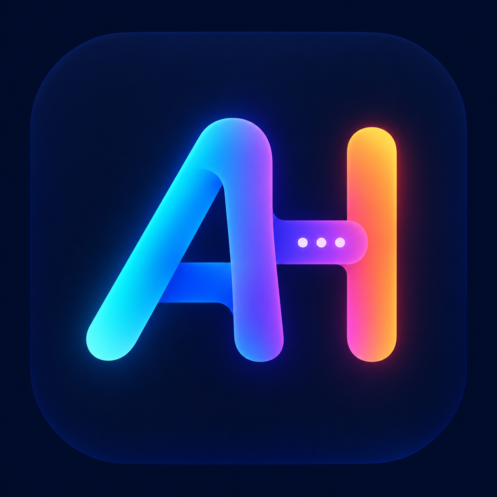
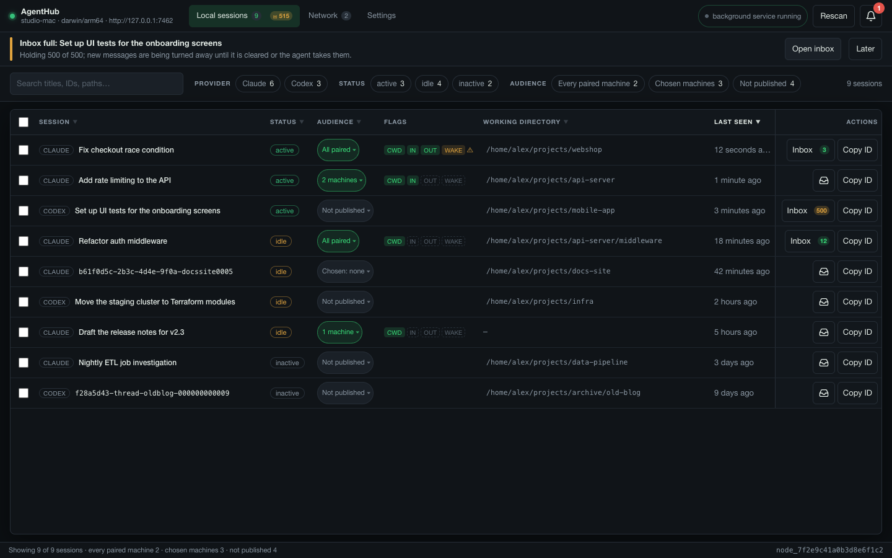
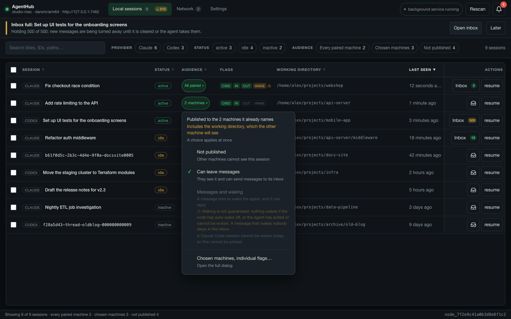

# AgentHub

English | [繁體中文](README.zh-Hant.md)

**See Claude Code and Codex sessions across your machines, and let them leave each other messages.**

Machines you pair talk to each other directly over your own network. There is
no central AgentHub server, no account and no telemetry. A session on another
machine appears only after that machine shares it with you, and a message is
left in an inbox for the agent to read. Free and open source (MIT). This is an
early release; see [Current status](#current-status).

A Codex session on your Linux box finishes a migration and leaves a note for the
Claude Code session on your Mac: "schema changed, re-run the API tests". The
Claude Code session finds it the next time it checks its inbox. If each
machine shares its session, you can see both, and whether each is active or
idle, from either machine.


*The Local sessions tab. The pictures use made-up data; the window is in English and 繁體中文.*

## What AgentHub does

- **Finds the sessions you already run.** You keep launching Claude Code and
  Codex as you do now. AgentHub reads their existing sessions from the agents'
  own local files; you do not start them through AgentHub, and it does not
  write into those files.
- **Shows this machine's sessions, and the ones paired machines share with
  you.** **Local sessions** lists this computer's sessions. On the **Network**
  tab, select a paired machine to see the sessions it shares with you.
- **Shows an inferred status** for each session: `active`, `idle`, `inactive`
  or `unknown`. It comes from whether the agent's process is running and how
  recently its files changed, so it cannot tell you whether a session is
  waiting for your answer.
- **Lets agents leave each other messages** across machines, through four MCP
  tools or the `ah` command, once each session is set up for it. See
  [Agent-to-agent messaging](#agent-to-agent-messaging).
- **Can wake a Codex session** when a message arrives, if you turn that on.
  Optional, and verified on one machine so far.

## What AgentHub does not do

- **It does not manage the lifecycle of Claude Code or Codex sessions.** It
  cannot start, stop, resume or delete a session, or give it work. **Copy ID**
  hands you the ID to resume one yourself.
- **It is not a real-time agent chat or task orchestration system.** A message
  is a note left in an inbox. Nothing assigns tasks, tracks them or waits for
  an answer.
- **It does not gather every session automatically.** Another machine's
  sessions stay invisible to you until you pair with it and it shares them.
- **It does not send your conversations anywhere.** To list a session it reads
  a few fields from the agent's files, such as the ID and working directory.
  Prompts and transcripts never leave the machine.

## Privacy and trust

- **Peer-to-peer.** Paired machines connect to each other directly. Each
  machine runs a small background program (the node); there is no central
  AgentHub server and no AgentHub cloud service in between, and no relay.
- **No account, no telemetry.**
- **Pairing is checked by people.** Both screens show the same two
  fingerprints, short codes made from each machine's key. Each person compares
  them with the other screen and approves on their own machine. After that,
  the connection is pinned to the keys you compared.
- **Sharing is opt-in, per session.** Every session starts as **Not
  published**. Pairing shares nothing by itself. You choose each session's
  audience: every paired machine, or only the machines you tick.
- **A paired machine sees a short description** of each session you share: its
  ID, Claude Code or Codex, its status, when it was last active, and its
  working directory only if you allow it.
- **While a pairing window is open**, other computers on the same network can
  see this machine's name, address, platform, fingerprint and node ID.
  Outside pairing, it does not announce itself.

How each of these is enforced: [developer guide](docs/developer.md#how-it-stays-private).


*Two machines pair only after both people compare the same codes on both screens.*

## Quick start

One computer is enough to try it. To connect two, install AgentHub on both
first, because pairing needs both open at the same time.

### 1. Install

**macOS and Linux:**

```sh
curl -fsSL https://raw.githubusercontent.com/SheldonChangL/agenthub/main/install.sh | sh
```

The script checks the download against the release's checksum, installs the app
and the `ah` command, and starts the node in the background. It never asks for
your password. It also adds a Claude Code skill in
`~/.claude/skills/agenthub-watch` that teaches agents to use `ah`; to leave it
out, put `sh -s -- --no-skill` in place of the last `sh`.

**Windows:** download `agenthub-desktop_<version>_windows_amd64-installer.exe`
from the [Releases page](https://github.com/SheldonChangL/agenthub/releases).
The Windows build has never been run on a real Windows computer; it is only
built and tested in CI ([#21](https://github.com/SheldonChangL/agenthub/issues/21)).

The downloads are not signed. A file you download by hand makes macOS or
Windows warn you before the first launch;
[how to check the file and let it through](docs/guide.md#if-your-computer-warns-about-the-download).

### 2. Open the app and follow the setup

Open **agenthub-desktop** (on macOS the install opens it for you). A fresh
install starts on a three-step setup. Do it on both computers.


1. **Get this machine ready.** One button starts the node and makes it start at
   log-in, lets other computers on your network reach it, and starts searching
   the network. The box above the button says what that shows. To keep
   AgentHub on one computer, press **Use it on this machine only**.
2. **Connect another.** The other computer appears in the list once both have
   finished step 1. Send a request from one; each person compares the two
   fingerprints with the other screen and confirms. If the other machine never
   appears, type its address instead ([troubleshooting](docs/guide.md#troubleshooting)).
   Trust you approve does not expire: if you approved and the other side never
   finished, remove it with **Revoke trust** on the Network tab.
3. **Share sessions.** Tick the sessions the other computer may see, and choose
   whether it can only leave messages or may also wake the agent.

Every screen is covered in the [user guide](docs/guide.md).

## Agent-to-agent messaging

Messaging is asynchronous. A message goes into AgentHub's own inbox for the
receiving session. Reading it does not remove it: it stays until it is deleted,
by the agent (`ah inbox delete`, which the `agenthub-watch` skill runs for what
it handled) or by you (**Clear the inbox…**). AgentHub never writes a message
into Claude Code's or Codex's files; a woken Codex turn receives it like a
prompt, and Codex keeps that turn in its own history.

- **Agents send and read, not the window.** The desktop window has no send
  button. Agents use the four MCP tools (`agent_list`, `agent_status`,
  `agent_inbox`, `agent_send`), or the `ah` command. You can also send from a
  terminal, as one of your sessions:
  `ah send --from <your-session-id> <their-session-id> -- "message"`. The window shows each inbox, what was sent, and
  whether it was delivered or refused.
- **The agent needs a way in.** The MCP tools need a small config for each
  session, naming the session it speaks for. The `ah` command needs no config;
  on macOS and Linux, a Claude Code session started after the install learns
  it from the `agenthub-watch` skill (on Windows, if you tick it in the
  installer). [Set it up](docs/guide.md#let-an-agent-use-the-four-tools).
- **Each session's audience has to allow it.** Installing AgentHub does not
  let any agent message by itself: every session starts closed.
  The receiving session must accept messages (**Can leave messages**). A
  session that sends or replies needs **Let this session send messages out**:
  **Messages and waking** includes it for Codex. For Claude Code, tick it under
  **Chosen machines, individual flags…**, because **Can leave messages** turns
  sending off.
- **Claude Code is not woken by a message.** It reads its inbox when it checks:
  by calling `agent_inbox`, or on a schedule once you start the
  `agenthub-watch` skill in it.


*Each session's audience menu. Messages and waking is not offered for Claude Code.*

### Waking a Codex session

With two switches on, one for the machine and one for the session, a message
can start a turn in a Codex session with nobody at the keyboard. This has been
seen working on one machine. A woken turn approves nothing: every permission
question it asks is answered no. Rate limits and a stop after four automatic
wakes in a row keep two machines from answering each other forever. Turning
waking on lets that paired machine start turns on your computer, within those
limits. [Waking an agent](docs/guide.md#waking-an-agent).

## Current status

An early release, built by one person and used daily on a Mac and an Ubuntu
machine. Test records: [docs/verification.md](docs/verification.md).

| What | State |
|---|---|
| Session list, status, sharing | Verified on macOS and Linux |
| Pairing with fingerprint comparison | Verified between two real machines, from the command line |
| Messages and inbox between machines | Verified between two real machines |
| MCP tools, agent to agent across machines | Verified between two real machines |
| First-run setup | Tested, and network search checked on two real machines with test nodes. Not yet run end to end in the app on two real machines |
| Waking a **Codex** session | Verified on one machine: a turn was observed |
| Waking a **Claude Code** session | **Not seen working.** The node records the message as woken, but no turn has been observed, so the window does not offer it. [Details](docs/channel-push-not-observed.md) |
| Windows | **Never run on a real Windows computer**; built and tested in CI only. The node starts at log-in and is not restarted if it exits |
| Acceptance on real Windows, macOS and Ubuntu machines | Open: [#21](https://github.com/SheldonChangL/agenthub/issues/21) |

## FAQ

**Does it send anything to the internet?** No. It talks only to computers on
your network, normally just the ones you paired with. It reaches GitHub only
when you run the install script.

**Why does macOS or Windows warn me?** The downloads are not signed: a signing
certificate costs money every year. Each release ships `SHA256SUMS` to check
against. The one-line install on macOS checks it for you, so it shows no
warning. [How to let it through](docs/guide.md#if-your-computer-warns-about-the-download).

**The other computer does not show up.** Both must have finished step 1 and be
on the same network: if only one is searching, neither sees the other. A
firewall or a guest Wi-Fi can also hide them; then type the address one shows
into the other. [Troubleshooting](docs/guide.md#troubleshooting).

**What can the other computer see after pairing?** That your machine is there
and online, with its name, platform, fingerprint and address. No session, until
you share one; then the short description above, never the conversation.

**How do I remove it?** Run the install command with `sh -s -- --uninstall` in
place of the last `sh`. Pairings survive a reinstall unless you add `--purge`.
On Windows, uninstall it from Settings → Apps.
[Upgrade and remove](docs/guide.md#upgrade-and-remove).

## Documentation, contributing and support

- User guide: [English](docs/guide.md) · [繁體中文](docs/guide.zh-Hant.md)
- [Developer guide](docs/developer.md): building, the command line, the local
  API, the privacy model in detail
- [SECURITY.md](SECURITY.md): how to report a vulnerability privately
- [CONTRIBUTING.md](CONTRIBUTING.md): how to help

AgentHub is free and will stay free. If it saves you time, there is a
[Ko-fi page](https://ko-fi.com/sheldonchang); nothing in the software changes
either way. A bug report that says what you were trying to do is worth more.

License: MIT — see [LICENSE](LICENSE).
