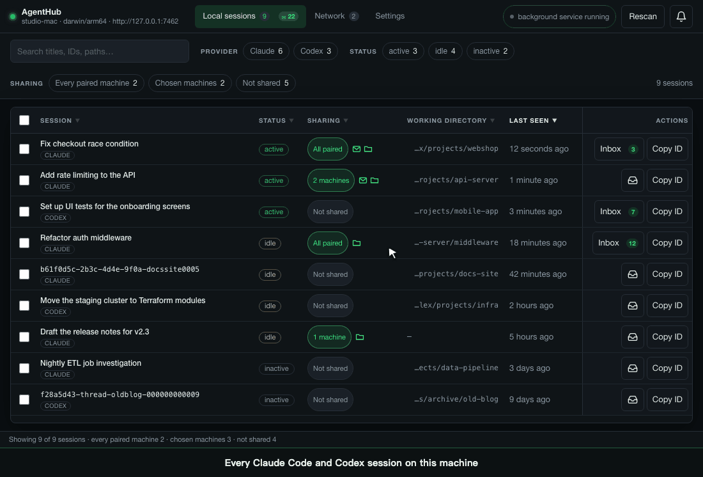

# AgentHub

English | [繁體中文](README.zh-Hant.md)

**See Claude Code and Codex sessions across your machines, and let them leave each other messages.**

Pair two machines on your own network, and each can see the sessions the other
chooses to share. Agents leave each other notes in an inbox: a Codex session on
your Linux box finishes a migration and tells the Claude Code session on your
Mac to re-run the API tests. No central server, no account, no telemetry. Free
and open source (MIT), and an early release: see [Status](#status).


*Share a session with a paired machine, see what it shares back, read the notes its agents left. Made-up data; the window is in English and 繁體中文.*

## Install

**macOS and Linux:**

```sh
curl -fsSL https://raw.githubusercontent.com/SheldonChangL/agenthub/main/install.sh | sh
```

The script checks the download against the release's checksum and never asks
for your password. It also adds a Claude Code skill that teaches agents to use
`ah`; put `sh -s -- --no-skill` in place of the last `sh` to leave it out.

**Windows:** the installer is on the
[Releases page](https://github.com/SheldonChangL/agenthub/releases). It has
never been run on a real Windows computer
([#21](https://github.com/SheldonChangL/agenthub/issues/21)). The downloads are
not signed, so a file you download by hand gets a warning;
[how to check it and let it through](docs/guide.md#if-your-computer-warns-about-the-download).

Then open **agenthub-desktop** on both machines and follow its three steps: get
this machine ready, connect the other one by comparing fingerprints on both
screens, and tick the sessions to share. The
[user guide](docs/guide.md#first-time-setup) walks through each screen.

## What it does, and what it does not

- **Lists the sessions you already run.** It reads Claude Code's and Codex's
  own files, so you keep starting them as you do now. It cannot start, stop or
  resume a session; **Copy ID** hands you the ID to resume one yourself.
- **Shares a session only when you say so**, with every paired machine or only
  the ones you tick. That machine gets a short summary, such as the session's
  ID, status and last activity, never its prompts or transcript.
- **Lets agents leave notes** through four MCP tools or the `ah` command, once
  a session is set to **Can leave messages**. A note waits in an inbox for the
  agent to read; nothing assigns or tracks work.
  [Set it up](docs/guide.md#let-an-agent-use-the-four-tools).
- **Can wake a Codex session** when a note arrives, if you turn that on.
  AgentHub cannot wake Claude Code; it reads its inbox when it checks.
  [Waking an agent](docs/guide.md#waking-an-agent).
  If both machines run only Claude Code under the same claude.ai account, you
  may not need AgentHub: Claude Code's own cross-session messaging, with Remote
  Control on in both sessions, reaches and wakes a session on the other machine
  through claude.ai.

## Privacy

Paired machines talk to each other directly; there is no relay. AgentHub talks
only to machines on your network, and reaches GitHub only when you run the
install script. Pairing is confirmed by people comparing the same fingerprints
on both screens, and pairing alone shares no session. Only while a pairing
window is open do other machines on the network see this machine's name,
address, platform, fingerprint and machine ID. [How each of these is enforced](docs/developer.md#how-it-stays-private).

## Status

An early release, built by one person and used daily on a Mac and an Ubuntu
machine. Messages and the MCP tools are verified between two real machines,
pairing from the command line, and waking a Codex session on one machine. The
first-run setup has not yet been run end to end in the app on two real
machines. Waking a Claude Code session has not been seen working, and the
Windows build has never run on a real Windows computer. [Test records](docs/verification.md).

## More

- User guide: [English](docs/guide.md) · [繁體中文](docs/guide.zh-Hant.md),
  including [upgrade and remove](docs/guide.md#upgrade-and-remove) and
  [troubleshooting](docs/guide.md#troubleshooting).
- [Developer guide](docs/developer.md): building, the command line, the local
  API, the privacy model in detail.
- [SECURITY.md](SECURITY.md) for reporting a vulnerability privately;
  [CONTRIBUTING.md](CONTRIBUTING.md) for helping.

AgentHub is free and will stay free. If it saves you time, there is a
[Ko-fi page](https://ko-fi.com/sheldonchang); a bug report that says what you
were trying to do is worth more. License: MIT, see [LICENSE](LICENSE).
