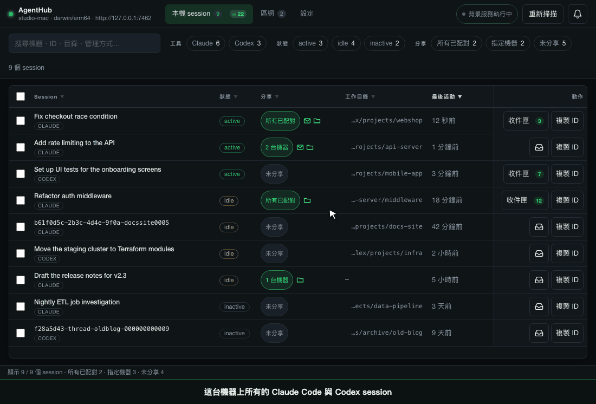

# AgentHub

[English](README.md) | 繁體中文

**查看不同機器上的 Claude Code 與 Codex session，也能讓它們互相留訊息。**

在自己的網路裡配對兩台機器，每台都看得到另一台選擇分享的 session。
agent 之間用收件匣互相留訊息：Linux 主機上的 Codex 跑完 migration，
留言請 Mac 上的 Claude Code 重跑 API 測試。沒有中央伺服器、不用帳號、不回傳使用資料。
免費開源（MIT），目前是早期版本，見[目前狀態](#目前狀態)。


*把 session 分享給配對過的機器、看它分享回來的 session、讀它的 agent 留下的訊息。畫面裡的資料都是虛構的；介面有英文與繁體中文。*

## 安裝

**macOS 與 Linux：**

```sh
curl -fsSL https://raw.githubusercontent.com/SheldonChangL/agenthub/main/install.sh | sh
```

腳本會先用該版本的檢查碼核對下載的檔案，過程中不會要你輸入密碼。
它也會放一個 Claude Code skill，教 agent 怎麼用 `ah`；不要的話，把最後的 `sh` 換成 `sh -s -- --no-skill`。

**Windows：**安裝程式在 [Releases 頁面](https://github.com/SheldonChangL/agenthub/releases)。
Windows 版從沒在真的 Windows 電腦上跑過（[#21](https://github.com/SheldonChangL/agenthub/issues/21)）。
下載檔沒有簽章，手動下載的檔案第一次開啟前會跳警告；[怎麼核對檔案、怎麼放行](docs/guide.zh-Hant.md#電腦跳出下載警告時)。

裝好後兩台都打開 **agenthub-desktop**，照三個步驟走：準備好這台機器、
在兩台螢幕上比對指紋連到另一台、勾選要分享的 session。
每個畫面的說明在[使用手冊](docs/guide.zh-Hant.md#第一次設定)。

## 做什麼、不做什麼

- **列出你本來就在跑的 session。** 它讀 Claude Code 與 Codex 自己的檔案，你照平常的方式開就好。
  它不能啟動、停止或 resume session；「複製 ID」會給你 ID，讓你自己去 resume。
- **你說要分享才分享**，給所有已配對機器，或只給你勾選的那幾台。
  對方拿到的是一段簡短摘要，例如 session 的 ID、狀態和最後活動時間，不含提示詞和對話紀錄。
- **讓 agent 互相留訊息**，透過四個 MCP 工具或 `ah` 指令，前提是那個 session 設成「可留訊息」。
  訊息留在收件匣等 agent 來讀；沒有任務指派或追蹤。[設定方式](docs/guide.zh-Hant.md#讓-agent-使用四個工具)。
- **可以用訊息喚醒 Codex session**，要你自己打開。那個 session 不必開著：AgentHub 會在背景把它的 thread 接回來。
  [喚醒 agent](docs/guide.zh-Hant.md#喚醒-agent)。
- **Claude Code 要自己檢查收件匣才會讀到訊息。** AgentHub 叫不醒它，所以 session 要一直開著，
  用一起裝好的 agenthub-watch skill 定時檢查。Claude Code 內建的跨 session 訊息也有同樣的前提：
  收訊息的 session 要開著，兩邊都要開 Remote Control、登入同一個 claude.ai 帳號，訊息會經過 claude.ai。
  如果兩台都只用 Claude Code、登入同一個帳號，用內建的可能就夠了。

## 隱私

配對過的機器彼此直接連線，中間沒有中繼。AgentHub 只和你網路上的機器溝通，
只有執行安裝腳本時才會連 GitHub。配對要兩邊的人在兩台螢幕上比對同一組指紋才算數，
而且配對本身不會分享任何 session。只有配對視窗開著時，同一個網路上的其他機器才看得到這台的名稱、位址、平台、指紋和機器 ID。
[每一點是怎麼做到的](docs/developer.md#how-it-stays-private)（英文）。

## 目前狀態

早期版本，一個人開發，每天在一台 Mac 和一台 Ubuntu 上使用。
訊息和 MCP 工具已在兩台實機之間驗證，配對在兩台實機之間用命令列驗證過，喚醒 Codex session 在一台機器上驗證過。
首次設定還沒在兩台實機的 app 上從頭跑過一次。喚醒 Claude Code session 還沒看過成功，Windows 版也從沒在真的 Windows 電腦上跑過。
[測試紀錄](docs/verification.md)（英文）。

## 更多

- 使用手冊：[繁體中文](docs/guide.zh-Hant.md) · [English](docs/guide.md)，
  包含[升級與移除](docs/guide.zh-Hant.md#升級與移除)和[疑難排解](docs/guide.zh-Hant.md#疑難排解)。
- [開發者文件](docs/developer.md)（英文）：建置、命令列、本機 API、隱私模型細節。
- [SECURITY.md](SECURITY.md)（英文）私下回報安全漏洞；[CONTRIBUTING.md](CONTRIBUTING.md)（英文）怎麼參與，issue 和 PR 用中文寫也可以。

AgentHub 免費，以後也會一直免費。如果它幫你省了時間，可以到 [Ko-fi 頁面](https://ko-fi.com/sheldonchang)支持一下；
回報 bug 時順便說說你當時想做什麼，比錢更有幫助。授權：MIT，見 [LICENSE](LICENSE)。
