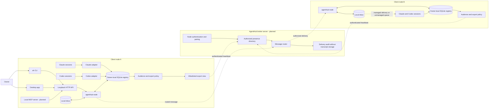

# Architecture

## Target topology

The Client A solid path exists in the local MVP. Client B represents another
installation of the same local components; all cross-client/server and
provider-delivery edges are planned. The broker is a logical server role;
deployment and transport are intentionally deferred until the identity,
pairing, and export contracts are implemented.

## Current implementation boundary

| Boundary | Current state |
|---|---|
| Provider session -> client node | Filesystem discovery is enabled; Codex App Server parsing exists but is not wired into the daemon |
| Owner -> client node | `ah`, desktop app, and loopback HTTP API are implemented |
| Client node -> broker server | Not implemented; non-loopback bind is rejected. Node identity, recipient-bound signed envelopes, a persisted outbound sequence, the trust store and the pairing schema exist; no transport carries them and no receiver consumes them |
| MCP client -> client node | Tool contracts are drafted; no MCP transport is running |
| Node -> AI agent message delivery | Local messages are queued only; no provider injection or wake-up |

`agenthub-node` owns the local registry and is the only component intended to write it. Adapters translate provider-specific metadata into one `Session` model. The CLI and the desktop app talk to the node rather than reading provider files or SQLite directly.

The desktop app is the owner's audience management surface: it lists every
local session, filters them by provider, status, audience, and working
directory, and applies an audience policy to a selection. It holds no state of
its own and lives in a separate Go module so that Wails' CGo requirement never
reaches the node or the CLI.

Codex has two discovery foundations: rollout metadata scanning, which is the enabled MVP path, and a JSON-RPC App Server client for `initialize` plus `thread/list`. The live client requests `useStateDbOnly: true`, decodes only identity/path/status fields, and maps `active`, `idle`, `notLoaded`, and `systemError` into AgentHub status. It is intentionally not wired into the daemon until transport lifecycle and reconnect behavior are specified.

## Platform boundary

Windows, macOS, and Linux share the same registry, protocol, API, CLI, filesystem metadata parsers, and privacy rules. Process enumeration is isolated behind a small interface with Windows and Unix implementations. Provider roots default to `%USERPROFILE%\\.claude` / `%USERPROFILE%\\.codex` on Windows and `$HOME/.claude` / `$HOME/.codex` elsewhere, and can be overridden for tests or nonstandard installs.

Cross-compilation proves source portability, not provider runtime behavior. Release acceptance therefore includes one real-host discovery smoke test per operating system.

## Session identity

The stable local key is `<provider>:<provider-session-id>`. A separate random node ID identifies the host installation. A future broker address is therefore `<node-id>/<provider>:<provider-session-id>`.

Provider metadata is untrusted input. Adapters validate identifiers, timestamps, and paths and ignore message content. Provider session IDs come from a metadata field rather than a filename, so `model.ValidateProviderSessionID` is the single rule every ingest path applies: an ID containing the address separator would move the boundary between node and session in a qualified address.

Validation failure is per record. Discovery skips an unusable session and reports the count rather than abandoning the scan, because anything able to write a file under a provider directory could otherwise disable discovery entirely. The boundary that fails closed is the export projection, not ingest.

## Lifecycle model

| Management | Evidence | Status quality |
|---|---|---|
| managed | Direct heartbeat and reported lifecycle | Authoritative while heartbeat is fresh |
| unmanaged | Metadata modification time plus provider process presence | Heuristic |

Normalized states:

- `active`: direct managed report, or very recent metadata correlated with a running provider process.
- `idle`: managed idle report, or recent metadata with a running provider process.
- `inactive`: stale metadata or expired managed heartbeat.
- `unknown`: required evidence is unavailable or invalid.

Every status response carries `statusSource` so consumers can distinguish reports from inference.

## Privacy boundary

Audience and export flags are stored in AgentHub, not provider files. Discovery
uses an upsert that never updates those owner-controlled fields, so provider
rescans cannot undo the owner's choice.

There are two views:

- Owner-local view: all local sessions, including private sessions.
- Owner export preview: the union of sessions published to at least one audience, projected into `SessionSummary`. Nothing consumes this preview over the network today.
- Per-peer export view: `HeartbeatBuilder.BuildFor(peer)` filters that same projection to sessions authorized for the named peer. It is implemented and tested but has no transport consumer.

`BuildFor` refuses a recipient that is not currently in `trusted_nodes`. The
audience filter alone cannot enforce `all_paired`: `Audience.PublishesTo`
returns true for an `all_paired` session and any non-empty string, so accepting
an arbitrary identifier would make `all_paired` mean "anyone who supplies a node
id". Checking trust in the builder also makes revocation immediate — a revoked
node stops receiving heartbeats without the owner revisiting each session's
audience. `Build` stays a union because it is the owner's own preview.

Every heartbeat also names the node it was built for, in a signed
`recipientNodeId`. Without it a snapshot is only bound to its sender, so a
snapshot built for one peer is a valid snapshot for every peer that trusts that
sender — the per-peer filtering above would be undone by anyone who could hand
the envelope on. `BuildFor(peer)` addresses the envelope to that already-trusted
peer. The owner preview is addressed to this node: it stays the union the owner
needs to see, and it is not usable as any peer's heartbeat, because the
recipient it names is not that peer. There is no way to produce an undirected
`node.heartbeat`; the constructor for undirected envelopes refuses the type.

The MVP local inbox accepts local destinations and parses both local and
qualified addresses, but a qualified remote address returns `UNKNOWN_NODE`
until routing exists. Remote `agent_send` must also require both an authorized
view and the destination session's `acceptMessages` flag.

The heartbeat builder projects each published session into `protocol.SessionSummary`,
a type separate from the owner-local `model.Session`. The projection copies field
by field, so a new registry field cannot become remotely visible by being added;
the schema's `additionalProperties: false` fails the build if one does. Session
addresses in the export view are qualified as `<node-id>/<provider>:<id>`.

`GET /v1/heartbeat` returns the complete broker envelope rather than a
differently-shaped preview, and tests validate both the builder output and the
HTTP response against `broker-protocol.schema.json`. This settles the shape and
per-peer filtering, not transport: no receiver authenticates, expires, or
deduplicates these envelopes yet, so the node must not be connected to a LAN.
The accepted audience and
migration behavior is recorded in
[ADR-001](decisions/001-session-audience-and-export-boundary.md).

## Node and broker boundary

The node identity has two parts. The random identifier persisted in SQLite is a
label and proves nothing: anyone can claim one. The Ed25519 keypair beside the
database is what a peer can check, and every envelope carries a signature over
itself with the signature field cleared.

The private key lives in `node.key` next to the database rather than inside it.
A database is copied, backed up and inspected far more casually than a file
named private key, and a copy that carried the key would clone this node's
identity. A truncated or corrupt key is reported rather than silently
regenerated, because a new identity would invalidate every pairing.

How the file protects the seed is platform-specific, because a single mechanism
would be a false claim on one of the two:

- **Unix**: the raw 32-byte Ed25519 seed at mode 0600. The kernel enforces that
  on every open, and the mode is re-checked on every load — a key restored from
  a backup as 0644 is refused rather than used silently.
- **Windows**: the seed encrypted with DPAPI for the current user, wrapped in a
  versioned envelope (`AHNK` magic, scheme byte, payload length). Go documents
  that `Chmod` on Windows only drives the read-only attribute and does not
  produce an owner-only ACL, so a `node.key` at "0600" there would be readable
  by anything that can reach the path. Because the blob is bound to the Windows
  user account, copying `node.key` to another machine or another user's profile
  yields a file that cannot be decrypted. No mode claim is made on Windows;
  DPAPI is the access control. The header exists so a file written by a future
  scheme is reported as such rather than mistaken for a damaged key.

The loader fails closed in both cases. It refuses anything under `node.key` that
is not a plain regular file — a symlink or a Windows reparse point there means
something else chose where the identity is read from — refuses a file too large
to be a key, and refuses a blob it cannot decrypt or that decrypts to the wrong
length. It never replaces a key it could not read. It also compares the `Lstat`
observation with the opened handle using `os.SameFile`: two checks that each say
"a regular file" do not prove they saw the same file, and the bytes that get used
must come from the file that was inspected. That window is small and reaching it
needs write access to a directory that is mode 0700 and owned by the same user
the key protects, so the check is defence in depth rather than the main barrier.

Creation writes the fully formed bytes to a temporary file, flushes them, and
only then links that content to `node.key`. The hard link is the
create-if-absent primitive: it is atomic and it fails if the name already exists.
So a concurrent start loses the race and reads the winner's key rather than
overwriting it, and any failure leaves `node.key` either absent or holding a
complete key — never the empty or truncated file that every later start would
refuse.

There is deliberately no second route. Creating the final name directly, even
with `O_EXCL`, publishes the name before the content and reopens the window this
ordering exists to close. When linking is unavailable the install fails with
`ErrKeyStorageUnsupported` and names the fix — move the data directory off a
FAT/exFAT volume or network share — because an operator can move a directory but
cannot recover an identity that was never written whole.

The displayed fingerprint is the public key's SHA-256 rendered as six groups of
four hex digits. The grouping is for a human comparing two screens during
pairing; an unbroken run of hex invites people to check the first characters and
stop.

Verification takes the key the receiver already trusts for that node ID. A key
travels inside `pair.request`, but holding a key is not identity: that key is
trusted only after a person compares fingerprints on both machines. The full
fingerprint must match — the API compares the whole value, because a check of
the first group or two is cheap to forge.

There are two verification calls, and the split is deliberate:

- `VerifySender(key, senderNodeID)` answers only "is this authentically from
  that node". It refuses a directed envelope rather than reporting it verified,
  so no future receiver can reach an accept decision on a heartbeat without also
  checking who the envelope was addressed to.
- `VerifyDirected(key, senderNodeID, localNodeID)` answers that question and
  "was this built for me". A signature says who wrote an envelope, never who may
  act on it.

Both check the signature first, and the order is part of the contract. The two
failures mean different things: `ErrUnsigned` is a stranger, `ErrNotAddressed`
is a known peer's envelope meant for somebody else — something a receiver may
reasonably count or log as traffic from a node it trusts. If a forgery could
produce the second, that reading would promote an unauthenticated sender to a
known one, so authenticity is decided before anything is said about the address.
Rewriting the recipient does not reach the address comparison at all: the
recipient is a signed field, so a redirected envelope fails as unsigned. The
local node ID is validated against the shared node-ID rule before it is accepted
as a destination, so a receiver that does not yet know its own identity cannot
match an envelope that carries the same unusable value.

A signature covers a length-prefixed encoding of the envelope's fields, not a
re-serialization of the Go value. The fields, in order, are `protocolVersion`,
`messageId`, `type`, `sentAt`, `nodeId`, `recipientNodeId` and the payload's raw
bytes; an undirected envelope contributes an empty recipient rather than
omitting the field, so a receiver reproducing the bytes never has to guess
whether a field is absent or empty. The payload travels as the exact bytes the
sender produced and is signed as those bytes. This is what makes a signature
reproducible by a receiver that only ever saw JSON: a Go struct serializes in
field order while the map it decodes into serializes in key order, and a uint64
returns as a float64, so signing a decoded value would fail every verification
between two processes.

Trust says a node ID belongs to a key. It grants no session access: an audience
is a separate decision, made per session, so pairing a machine publishes
nothing. Revoking removes the trust row and every grant that node held in one
transaction, because a grant left behind would take effect again if the node
were paired a second time. A node already trusted with a different key is
refused rather than updated; silently accepting a new key is how a machine gets
impersonated.

A target broker heartbeat is a replaceable presence snapshot with:

- protocol version
- a signature over the envelope
- node ID and display name
- the recipient node ID it was built for
- monotonically increasing sequence number
- sent/expiry timestamps
- capabilities
- session summaries authorized for the receiving peer only

The sequence is owned by the registry and stored in SQLite, not by the builder.
One counter covers everything this node sends, reserved by a single atomic
`UPDATE`, so concurrent builds and a recreated builder cannot be handed the same
number. It survives a restart, which an in-memory counter does not: a counter
that returns to one after a restart forces a receiver to choose between
rejecting the restarted sender forever and not checking sequences at all. Gaps
are allowed — a build that fails after reserving a number does not give it back
— because a gap costs a receiver nothing while a repeat makes a fresh snapshot
indistinguishable from a replayed one. SQLite's INTEGER is signed, so the
counter stops at `MaxInt64` and refuses to allocate rather than wrapping,
returning zero, or reusing the last value; a build that cannot reserve a number
produces no envelope. Reaching that limit and finding the counter damaged or
missing are reported apart — `ErrSequenceExhausted` against
`ErrSequenceUnavailable` — because they describe different damage, not because
one is milder. Both fail closed.

Opening the database is not a repair. The upgrade that creates the counter also
records a marker row in `schema_markers`, written in the same transaction, and
that marker — not the presence of the table — is what says the migration ever
ran. Table existence cannot carry that meaning: dropping the table would then
make a node that has been publishing for months look like a database from before
the counter existed, and the upgrade path for those starts at zero. So `Open`
reads both and acts on the pair:

| Marker | Counter table | Result |
|---|---|---|
| absent | absent | genuine pre-counter database: marker, table and row created in one transaction; first allocation is 1 |
| present and valid | present and valid | preserved and opened, exactly as found |
| present and valid | absent | `ErrSequenceUnavailable`; nothing is recreated |
| absent | present | `ErrSequenceUnavailable`; the two are written together, so one alone is lost evidence |
| present but malformed, missing its row, or from another version | any | `ErrSequenceUnavailable` |

The counter row is checked the same way: missing, duplicated, or holding a value
this store could not have written all fail with `ErrSequenceUnavailable` and
write nothing.

Re-creating either is not a recovery. It restarts at zero under the same node
identity and republishes sequences a receiver may already hold, signed by this
node's own key — the replay the persisted counter exists to prevent — and the
previous high-water mark is exactly what has been lost. The safe answers are a
backup whose high-water mark cannot roll back, or rotating to a new node
identity with explicit re-pairing.

### What this does not protect against

The marker detects *inconsistent* loss: one piece of the evidence gone while
another contradicts it. It cannot detect the loss of all of it at once. A
database rolled back to a backup taken before any heartbeat, or deleted and
recreated together with `node.key`, presents no contradiction and is
indistinguishable from a first start — as it would be to any scheme that keeps
its high-water mark in the same file it is protecting. Local storage
authenticity is not something this build can infer. Ruling out a full rollback
needs a monotonic store outside the database, or a node identity that rotates
whenever the database does; AgentHub implements neither and claims neither.

Consumers replace the complete previous snapshot for that node; they never
merge session arrays. **A session absent from a heartbeat has had its
publication revoked**, and merging would resurrect it: revocation is expressed
by omission, so a consumer that merges never sees one. A snapshot is also scoped
to its recipient — a session published to selected nodes appears only in the
heartbeats built for those nodes — so one peer's snapshot says nothing about
another's and the two must never be combined. The broker must authenticate nodes, reject replayed or expired
heartbeats, and route only the export view produced by the owner node. These are
target requirements, not capabilities of the current build.

### The receiving side

`POST /v1/heartbeat` accepts one peer's snapshot. It is the first endpoint that
exists to be called by another machine, so the order of its checks is part of
the contract rather than an implementation detail:

1. Decode the envelope. Nothing about it is believed yet.
2. Look the sender up in the trust store. An unpaired node is refused here,
   before anything is read from its payload.
3. Verify the signature *and* the recipient together, using the key the owner
   already recorded for that node ID — never a key carried in the envelope.
4. Only then read the payload.

Every refusal before step 4 answers `403` with an identical body. A caller must
not be able to tell "I do not know you" from "your signature is wrong" from
"that was addressed to somebody else": the difference is an oracle for which
nodes this owner has paired with, and answering it would leak the trust store to
anyone who can reach the port.

Storage enforces the replacement contract structurally. One peer holds exactly
one row containing the whole payload as the bytes that were verified, so there
is nowhere to merge into — a consumer that wanted to combine two snapshots would
have to defeat the schema. The sequence must *strictly* advance: equal is
refused along with lower, because a repeat of the last number is precisely what
a captured delivery replayed later looks like. A heartbeat whose own expiry has
already passed is refused rather than stored and hidden.

An expired snapshot makes its peer read as offline, not absent. The peer stays
listed with the moment it was last heard from, because "went quiet at 10:04" is
what an owner needs and deleting the row would make a peer that stopped sending
indistinguishable from one that was never paired. Revoking a node discards its
snapshot along with its grants: trust is what made that view admissible, so
withdrawing trust withdraws the view.

The centralized broker is trusted with metadata the owner has authorized for
routing. It must not receive private registry rows or provider transcripts and
must not persist message bodies. End-to-end encryption between peer nodes is a
possible later hardening step, not a current guarantee.

## Network safety

The MVP HTTP API binds to loopback. A future LAN mode must require authenticated pairing, validate request origins where applicable, use TLS or a mutually authenticated overlay, and never reuse the local API as an unauthenticated LAN endpoint.

The current API rejects non-loopback browser origins, emits no-store/nosniff headers, validates bounded JSON bodies, parameterizes all SQL, and paginates session listings. This is defense in depth for the local API, not a substitute for LAN authentication.

Loopback is a same-host trust boundary, not per-user authentication. Another process or OS account that can connect to the user's loopback port may access the local API. A production LAN release should add capability-token or OS-credential authentication before broadening the bind address.
