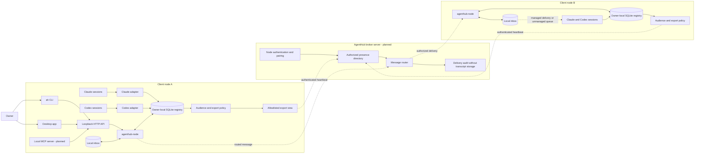

# Architecture

## Target topology

The Client A solid path exists in the local MVP. Client B represents another
installation of the same local components; all cross-client/server and
provider-delivery edges are planned. The broker is a logical server role;
deployment and transport are intentionally deferred until the identity,
pairing, and export contracts are implemented.

## Current implementation boundary

| Boundary | Current state |
|---|---|
| Provider session -> client node | Filesystem discovery is enabled; Codex App Server parsing exists but is not wired into the daemon |
| Owner -> client node | `ah`, desktop app, and loopback HTTP API are implemented |
| Client node -> broker server | Not implemented; non-loopback bind is rejected. Node identity, signed envelopes, the trust store and the pairing schema exist; no transport carries them |
| MCP client -> client node | Tool contracts are drafted; no MCP transport is running |
| Node -> AI agent message delivery | Local messages are queued only; no provider injection or wake-up |

`agenthub-node` owns the local registry and is the only component intended to write it. Adapters translate provider-specific metadata into one `Session` model. The CLI and the desktop app talk to the node rather than reading provider files or SQLite directly.

The desktop app is the owner's visibility management surface: it lists every local session, filters them by provider, status, visibility, and working directory, and applies one publish or unpublish choice to a whole selection. It holds no state of its own and lives in a separate Go module so that Wails' CGo requirement never reaches the node or the CLI.

Codex has two discovery foundations: rollout metadata scanning, which is the enabled MVP path, and a JSON-RPC App Server client for `initialize` plus `thread/list`. The live client requests `useStateDbOnly: true`, decodes only identity/path/status fields, and maps `active`, `idle`, `notLoaded`, and `systemError` into AgentHub status. It is intentionally not wired into the daemon until transport lifecycle and reconnect behavior are specified.

## Platform boundary

Windows, macOS, and Linux share the same registry, protocol, API, CLI, filesystem metadata parsers, and privacy rules. Process enumeration is isolated behind a small interface with Windows and Unix implementations. Provider roots default to `%USERPROFILE%\\.claude` / `%USERPROFILE%\\.codex` on Windows and `$HOME/.claude` / `$HOME/.codex` elsewhere, and can be overridden for tests or nonstandard installs.

Cross-compilation proves source portability, not provider runtime behavior. Release acceptance therefore includes one real-host discovery smoke test per operating system.

## Session identity

The stable local key is `<provider>:<provider-session-id>`. A separate random node ID identifies the host installation. A future broker address is therefore `<node-id>/<provider>:<provider-session-id>`.

Provider metadata is untrusted input. Adapters validate identifiers, timestamps, and paths and ignore message content. Provider session IDs come from a metadata field rather than a filename, so `model.ValidateProviderSessionID` is the single rule every ingest path applies: an ID containing the address separator would move the boundary between node and session in a qualified address.

Validation failure is per record. Discovery skips an unusable session and reports the count rather than abandoning the scan, because anything able to write a file under a provider directory could otherwise disable discovery entirely. The boundary that fails closed is the export projection, not ingest.

## Lifecycle model

| Management | Evidence | Status quality |
|---|---|---|
| managed | Direct heartbeat and reported lifecycle | Authoritative while heartbeat is fresh |
| unmanaged | Metadata modification time plus provider process presence | Heuristic |

Normalized states:

- `active`: direct managed report, or very recent metadata correlated with a running provider process.
- `idle`: managed idle report, or recent metadata with a running provider process.
- `inactive`: stale metadata or expired managed heartbeat.
- `unknown`: required evidence is unavailable or invalid.

Every status response carries `statusSource` so consumers can distinguish reports from inference.

## Privacy boundary

Visibility is stored in AgentHub, not provider files. Discovery uses an upsert that never updates `visibility`, so provider rescans cannot undo the owner's choice.

There are two views:

- Owner-local view: all local sessions, including private sessions.
- Current export preview: sessions marked public, projected into `SessionSummary`. Nothing consumes this preview over the network today.
- Target per-peer export view: sessions authorized for that peer, projected into an allowlisted `SessionSummary`.

`agent_send` is allowed only when the destination is addressable in the caller's authorized view. The MVP local inbox accepts local destinations; remote delivery is deferred.

The heartbeat builder projects each public session into `protocol.SessionSummary`,
a type separate from the owner-local `model.Session`. The projection copies field
by field, so a new registry field cannot become remotely visible by being added;
the schema's `additionalProperties: false` fails the build if one does. Session
addresses in the export view are qualified as `<node-id>/<provider>:<id>`.

`GET /v1/heartbeat` returns the complete broker envelope rather than a
differently-shaped preview, and tests validate both the builder output and the
HTTP response against `broker-protocol.schema.json`. This settles the shape, not
the transport: authentication, pairing, and per-peer audience filtering are still
missing, so the node must not be connected to a LAN. The accepted audience and
migration behavior is recorded in
[ADR-001](decisions/001-session-audience-and-export-boundary.md).

## Node and broker boundary

The node identity has two parts. The random identifier persisted in SQLite is a
label and proves nothing: anyone can claim one. The Ed25519 keypair beside the
database is what a peer can check, and every envelope carries a signature over
itself with the signature field cleared.

The private key lives in `node.key` next to the database rather than inside it,
mode 0600. A database is copied, backed up and inspected far more casually than
a file named private key, and a copy that carried the key would clone this
node's identity. A truncated or corrupt key is reported rather than silently
regenerated, because a new identity would invalidate every pairing.

The displayed fingerprint is the public key's SHA-256 rendered as six groups of
four hex digits. The grouping is for a human comparing two screens during
pairing; an unbroken run of hex invites people to check the first characters and
stop.

`Verify` takes the key the receiver already trusts for that node ID. A key
travels inside `pair.request`, but holding a key is not identity: that key is
trusted only after a person compares fingerprints on both machines. The full
fingerprint must match — the API compares the whole value, because a check of
the first group or two is cheap to forge.

A signature covers a length-prefixed encoding of the envelope's fields, not a
re-serialization of the Go value. The payload travels as the exact bytes the
sender produced and is signed as those bytes. This is what makes a signature
reproducible by a receiver that only ever saw JSON: a Go struct serializes in
field order while the map it decodes into serializes in key order, and a uint64
returns as a float64, so signing a decoded value would fail every verification
between two processes.

Trust says a node ID belongs to a key. It grants no session access: an audience
is a separate decision, made per session, so pairing a machine publishes
nothing. Revoking removes the trust row and every grant that node held in one
transaction, because a grant left behind would take effect again if the node
were paired a second time. A node already trusted with a different key is
refused rather than updated; silently accepting a new key is how a machine gets
impersonated.

A target broker heartbeat is a replaceable presence snapshot with:

- protocol version
- a signature over the envelope
- node ID and display name
- monotonically increasing sequence number
- sent/expiry timestamps
- capabilities
- session summaries authorized for the receiving peer only

Consumers replace the complete previous snapshot for that node; they never
merge session arrays. **A session absent from a heartbeat has had its
publication revoked**, and merging would resurrect it: revocation is expressed
by omission, so a consumer that merges never sees one. A snapshot is also scoped
to its recipient — a session published to selected nodes appears only in the
heartbeats built for those nodes — so one peer's snapshot says nothing about
another's and the two must never be combined. The broker must authenticate nodes, reject replayed or expired
heartbeats, and route only the export view produced by the owner node. These are
target requirements, not capabilities of the current build.

The centralized broker is trusted with metadata the owner has authorized for
routing. It must not receive private registry rows or provider transcripts and
must not persist message bodies. End-to-end encryption between peer nodes is a
possible later hardening step, not a current guarantee.

## Network safety

The MVP HTTP API binds to loopback. A future LAN mode must require authenticated pairing, validate request origins where applicable, use TLS or a mutually authenticated overlay, and never reuse the local API as an unauthenticated LAN endpoint.

The current API rejects non-loopback browser origins, emits no-store/nosniff headers, validates bounded JSON bodies, parameterizes all SQL, and paginates session listings. This is defense in depth for the local API, not a substitute for LAN authentication.

Loopback is a same-host trust boundary, not per-user authentication. Another process or OS account that can connect to the user's loopback port may access the local API. A production LAN release should add capability-token or OS-credential authentication before broadening the bind address.
