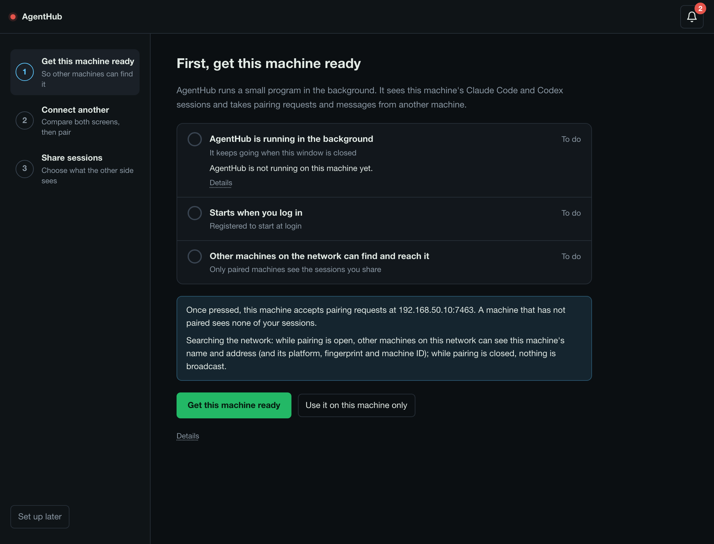
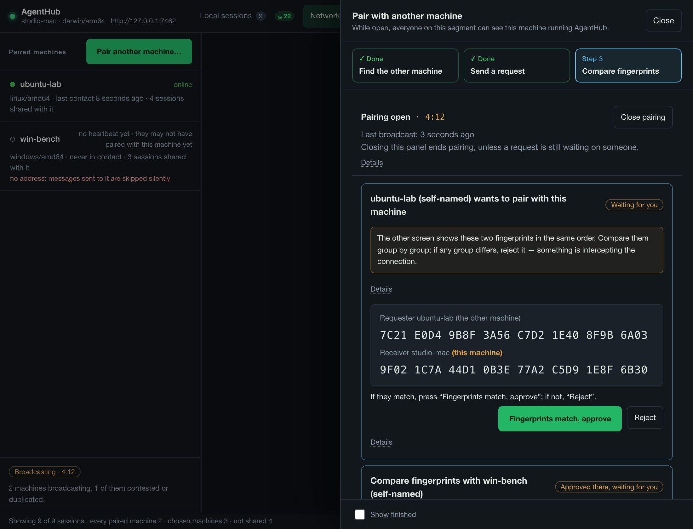
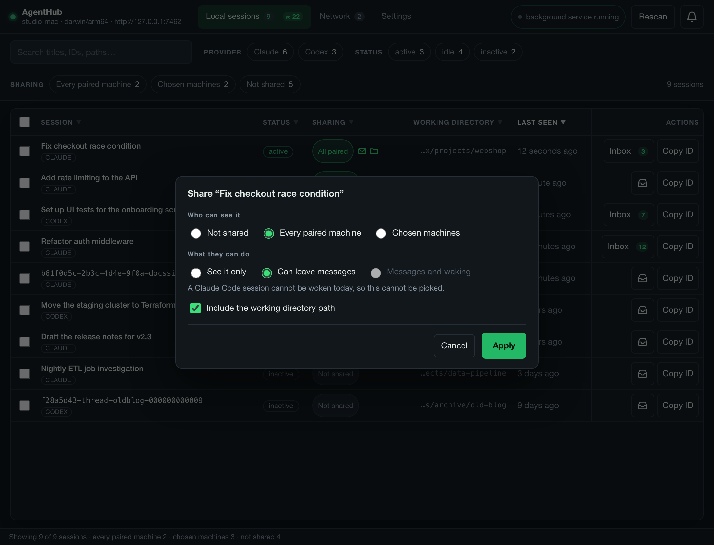

# AgentHub user guide

English | [繁體中文](guide.zh-Hant.md) · [README](../README.md) · [Developer guide](developer.md)

This guide walks through AgentHub one task at a time. Button names are written
in **bold** exactly as the window shows them in English. The machine names and
addresses in the examples (studio-mac, ubuntu-lab, Demo-MacBook, 192.168.50.10) are made up.

A few words used throughout:

- **Background service**: the small AgentHub program (`agenthub-node`) that
  runs in the background on each machine. The window you click on is only its
  control panel.
- **Machine ID**: the `node_…` value that names a machine. **Copy machine ID**
  puts it on the clipboard, in a paired machine's details on the Network tab
  and in Settings → This machine's identity.
- **Pairing**: introducing two machines to each other once, so they trust
  each other from then on.
- **Fingerprint**: a short code made from a machine's key, shown as groups of
  four characters. Two people read it off two screens to check that each
  machine is talking to the other one and nobody in between.
- **Sharing** a session: letting paired machines see it. A session you have
  not shared is **Not shared**.
- **Heartbeat**: the short signed update each machine sends every paired
  machine every 15 seconds. It says AgentHub is up and carries the sessions
  shared with that machine. "No heartbeat yet" means nothing has arrived from
  it.
- **Searching the network** (the background service's `-discover`): listening
  for other machines' announcements on the local network, and announcing this
  one while pairing is open. A fresh install has it off; step 1 of the setup
  turns it on.

Contents:

1. [Install](#install)
2. [First-time setup](#first-time-setup)
3. [Pair another machine](#pair-another-machine)
4. [Share a session](#share-a-session)
5. [Inbox and messages](#inbox-and-messages)
6. [Let an agent use the four tools](#let-an-agent-use-the-four-tools)
7. [Waking an agent](#waking-an-agent)
8. [Notifications](#notifications)
9. [The background service](#the-background-service)
10. [Upgrade and remove](#upgrade-and-remove)
11. [Troubleshooting](#troubleshooting)

## Install

After this chapter AgentHub is on your computer and its background service is
registered to start when you log in.

### macOS and Linux

Paste this into a terminal:

```sh
curl -fsSL https://raw.githubusercontent.com/SheldonChangL/agenthub/main/install.sh | sh
```

The script downloads the release for your machine and checks it against the
release's own checksum list (`SHA256SUMS`) before it unpacks anything. It then
puts the app in `/Applications` on macOS or `~/.local/share/agenthub` on Linux,
adds the `ah` command to `~/.local/bin`, registers the background service, and
installs a small Claude Code skill in `~/.claude/skills/agenthub-watch` so
agents on this machine know how to use `ah` (put `sh -s -- --no-skill` in place
of the last `sh` to leave it out). It never uses `sudo` and never asks for your
password.

Want to read it before running it? `curl -fsSL https://raw.githubusercontent.com/SheldonChangL/agenthub/main/install.sh | less`.
Every file it writes and every option it takes is listed in
[install-script.md](install-script.md).

On Linux the window needs GTK 3 and WebKit2GTK. The script picks the right
build for your system and tells you which package to install if it is missing.

To open the app:

- **macOS:** the script opens it when it finishes. After that, open
  agenthub-desktop from Applications.
- **Linux:** AgentHub in your applications menu, or `agenthub-desktop` in a new
  terminal (the script puts it in `~/.local/bin`).

### Windows

AgentHub has never been run on a real Windows computer. The Windows build is
built and tested in CI only, and acceptance on real machines is still open
([#21](https://github.com/SheldonChangL/agenthub/issues/21),
[verification.md](verification.md#build-matrix)). What follows is what the
installer is written to do.

1. Open the [Releases page](https://github.com/SheldonChangL/agenthub/releases)
   and download `agenthub-desktop_<version>_windows_amd64-installer.exe`
   (Windows 10 or 11, 64-bit).
2. Run it. Windows warns you first; see the next section.
3. The installer puts the app in place (by default in
   `C:\Program Files\agenthub-desktop\agenthub-desktop`), registers the
   background service with Task Scheduler, starts it, and adds a Start menu entry
   and a desktop shortcut, both named agenthub-desktop. Open the app from
   either. The Claude Code skill is a box on the installer's components page,
   unticked by default.

Prefer no installer? The `..._windows_amd64.zip` from the same page unpacks and
runs. Keep `ah.exe`, `agenthub-node.exe` and `agenthub-mcp.exe` in the same
folder as the app.

### If your computer warns about the download

None of the AgentHub files are signed. A signing certificate costs money every
year and this project has not bought one, so your computer is right to say that
nothing vouches for the file. What you can check instead is the checksum: every
release ships a `SHA256SUMS` file, and the same values are in the release
notes.

- **macOS, installed with the one-line command:** no warning. The script has
  already checked the checksum, so it clears the "downloaded from the internet"
  mark itself.
- **macOS, installed from the `.dmg` by hand:** the first double-click is
  refused.
  - macOS 15 Sequoia and later: click **Done**, then open System Settings →
    Privacy & Security, scroll to **Security**, press **Open Anyway** and
    confirm.
  - macOS 14 and earlier: right-click the app, choose **Open**, then **Open**
    again.
  - From a terminal, either version:
    `xattr -dr com.apple.quarantine /Applications/agenthub-desktop.app`
- **Windows:** SmartScreen says "Windows protected your PC". Press **More
  info**, then **Run anyway**.
- **Linux:** no warning.

To check a file by hand before opening it:

```sh
shasum -a 256 -c SHA256SUMS --ignore-missing     # macOS
sha256sum -c SHA256SUMS --ignore-missing         # Linux
```

```powershell
Get-FileHash .\agenthub-desktop_<version>_windows_amd64-installer.exe -Algorithm SHA256
```

On Windows, compare the printed value with the matching line in `SHA256SUMS`.

## First-time setup

After this chapter the background service runs, other machines on your
network can reach it (if you chose that), and you have either paired a second
machine or skipped that for later.

The first time you open AgentHub, the window shows a three-step setup. The
steps are listed on the left; the current one fills the right. Nothing is shared
by any of this until you tick sessions in step 3.



### Step 1: Get this machine ready

The heading reads **First, get this machine ready**, above three checks:

| Check | What it means |
|---|---|
| **AgentHub is running in the background** | The background service is running. It keeps going when the window is closed. |
| **Starts when you log in** | The background service is registered with launchd (macOS), `systemd --user` (Linux) or Task Scheduler (Windows). |
| **Other machines on the network can find and reach it** | AgentHub listens on an address on your home or office network, so other machines can connect, and searches the network, so they can find it. |

A blue box above the buttons says what the button will open, in two sentences:

- the address, for example "Once pressed, this machine accepts pairing requests
  at 192.168.50.10:7463. A machine that has not paired sees none of your
  sessions."
- the search: "Searching the network: while pairing is open, other machines on
  this network can see this machine's name and address (and its platform,
  fingerprint and machine ID); while pairing is closed, nothing is broadcast."

If the machine has more than one private network address, you pick one first
under **Which network should other machines use to reach this one?**

Press **Get this machine ready**. The window starts the background service,
registers it, opens the network address, turns on searching, restarts the
service so the change takes effect, and ticks each row as it finishes. When everything is done the
step shows **This machine is ready** and moves on by itself.

The button names what is left to do. If only the network part is left, it reads
**Open to the network and continue**. If the address is already open and only
searching is off (an older version opened it without searching), it reads
**Search the network and continue**, with **Next, without searching** beside
it. Without searching, the other machine does not show up in step 2's list,
and you pair by typing its address. If searching could not be turned on, the
step says so and offers **Next** anyway, for the same reason.

If the address is already open and searching is off, but the background service
is not running — it is stopped, AgentHub is running outside it, or its status is
still being read — the button reads **Get this machine ready**, with **Get this
machine ready, without searching** beside it. That second button does the same
to the service as the first (it starts it, or sends you to Settings to confirm
the database first) but writes no network setting, so searching stays off; once
the service is running, it moves on to step 2.

Prefer to keep AgentHub on this one machine? Press **Use it on this machine
only**. Step 2 is then marked **Staying on this machine** and skipped.

**If something fails**, the row that failed shows **Not done** with one plain
sentence, and **Details** under it holds the original error. Press **Try
again**. The setup does not move on until the failure is fixed. Two cases stop
it on purpose:

- AgentHub is already running but was not started as a background service (you
  started it from a terminal, say). The window sends you to Settings to confirm
  which database it uses before installing, because installing on a
  different database would give the machine a new identity. **Continue setup**
  in the title bar brings you back.
- Settings → Connection settings has changes you have not saved. The setup will not
  save them for you; save or reload that page first.

If the machine has no private network address at all, the step says so and
offers only **Use it on this machine only**.

### Step 2: Connect another

Step 2 is pairing, and it needs the other machine too. See
[Pair another machine](#pair-another-machine) for every screen in it. In short:
finish step 1 on both machines, bring both to this step, send a request from
one to the other, and compare the fingerprints on both screens. If this
machine is not searching, the list's place says so and offers **Start
searching the network**.

**Skip for now, pair later** skips it. **Back** returns to step 1.

### Step 3: Share sessions

The heading reads **Choose the sessions the other side can see**. The list shows
this machine's Claude Code and Codex sessions, newest first: the 8 most recent,
and a link such as **Show all 12** for the rest. Nothing is ticked to begin
with.

1. Tick the sessions you want the paired machine to see.
2. Choose what the other side can do:
   - **Can leave messages**: they see the session and can leave messages in
     its inbox, and the session can reply.
   - **Messages and waking**: a message also tries to wake the agent. This one
     cannot be picked when every ticked session is a Claude Code session,
     because Claude Code sessions cannot be woken today.
3. Press **Share 2 sessions**. The number follows what you ticked; with nothing
   ticked the button reads **Tick the sessions to share first** and cannot be
   pressed.

The setup never shares a working directory. If no session is listed yet, start
one in Claude Code or Codex and press **Rescan**. **Skip for now** leaves
everything not shared.

The last screen, **All set**, says what was shared and with whom. Press **Start
using AgentHub** to reach the main window.

### Leaving and coming back

**Set up later** at the bottom left puts the setup away. **Continue setup** in
the title bar brings it back at the first unfinished step, and Settings →
Appearance → **Show first-run setup** opens it again at the first unfinished
step, with any step you skipped offered again.

## Pair another machine

After this chapter two machines trust each other. Pairing shares no session on
its own; you still choose what each one sees.

Both people have to act. Each machine records its own trust, so pairing is
finished only when both screens have said yes.

### From the first-run setup

1. On both machines, finish step 1 and go to step 2, **Connect to another
   machine**. The other machine appears under **Machines found on this
   network** only when both have finished step 1: a machine is seen only while
   it searches and its pairing window is open, and sees others only while it
   searches. If only one of the two searches, neither sees the other. Once both
   search, it takes a few seconds. If this machine's list says it is not
   looking, press **Start searching the network**.
   The name shown is the name that machine gave itself, marked **self-named**,
   because nothing has been verified yet.
2. On one machine (call it studio-mac), press **Send pairing request** on the
   other machine's row. studio-mac now shows **Waiting for Demo-MacBook to
   press Approve**. Until Demo-MacBook approves, the only button there is
   **Cancel this request**: there is nothing to compare yet.
3. On the other machine, Demo-MacBook, a card reads **studio-mac (self-named)
   wants to pair with this machine**, with two fingerprints: the requester's on
   top, the receiver's underneath.
4. Read the fingerprints aloud to each other, or look at both screens side by
   side. Compare every group, all the way to the end. If they match, press
   **Same — approve** on Demo-MacBook.
5. studio-mac now shows **Compare fingerprints with Demo-MacBook (self-named)**
   with the same two fingerprints. Compare them again and press **Same — finish
   pairing**.
6. Step 2 now says **Paired with 1 machine.** Press **Next**.



**If any group differs**, press **Different — reject** on either machine.
Nothing is trusted on either side. A mismatch means the two machines may not be
talking directly; find out which machine you actually reached before you try
again.

A request nobody answers times out after five minutes and leaves nothing
behind.

**If you approved and the other side never finished.** Once Demo-MacBook has
approved, it trusts studio-mac, and nothing makes that
expire: Demo-MacBook cannot tell whether studio-mac ever pressed **Same —
finish pairing**. If the pairing was abandoned, remove it on Demo-MacBook with
**Revoke trust** on the Network tab (or `ah revoke <node-id>`).

### Reading the list of machines found

Everything in that list comes from packets anyone on your network can send, so
nothing in it has been checked. Step 2 and the Network tab's drawer both keep
the warning in a fold under the list, **Can this list be trusted?**: "Nothing in
this list has been verified and appearing in it grants nothing." Use a row to
find the right machine, and let the fingerprint comparison settle which machine
it is. Some rows carry a mark:

- **(no name given)**: the announcement carried no name. Check the machine ID
  and address under **Details** against the other screen.
- **identity contested** or **name or fingerprint duplicated**: another
  announcement on the network conflicts with this one, and at least one of the
  two is fake. A red line on the row says why. Do not pair with it unless you
  can check on the other machine directly.

A machine stays in the list for 90 seconds after its last announcement, so one
that just closed pairing can still be listed for a while.

### What searching shows, and when

While searching is on, this machine listens for announcements on the network
all the time; listening sends nothing. It announces itself (name, address,
platform, fingerprint, machine ID) only while its pairing window is open. A window
lasts five minutes. While the setup stays on step 2, it reopens by itself when
it runs out, so this machine stays findable for as long as you are on that
step. Leaving step 2, or closing the Network tab's pairing drawer, ends it
unless a request is still waiting on someone.

### When the other machine does not show up

First check that both machines finished step 1 and that neither says it is
not looking; if one does, press **Start searching the network** there.
Searching also needs both machines on the same network, with nothing between
them that blocks multicast. A firewall, a guest Wi-Fi, or two different
networks all hide them from each other. Type the address instead:

1. On step 2, open **Can't find the other machine?**
2. That section shows this machine's own address, for example
   `192.168.50.10:7463`, with a **Copy** button.
3. On the other machine, type that address into the same field and press
   **Send**. The rest is the same as above.

If the address section says nothing can reach this machine yet, press **Back to
step 1** and open it to the network there.

When the two machines cannot reach each other at all, the last resort is
**Enter pairing details by hand…**, in the same **Can't find the other
machine?** section: each side copies five fields from the
other's `ah node` output. The [developer guide](developer.md#pairing-from-a-terminal)
has the terminal commands.

### From the Network tab, later

Open the **Network** tab and press **Pair another machine…** above the list of
paired machines. A drawer titled **Pair with another machine** opens and starts
pairing by itself. A bar across the top shows **Find the other machine**, **Send
a request** and **Compare fingerprints**, and the drawer shows one screen at a
time:

- **Nothing waiting yet: find the other machine.** The machines found on the
  network are listed, each with **Send pairing request**. Under the list are
  the fold **Can this list be trusted?**, this machine's own address with a
  **Copy** button (under "The address for the other machine to type"), and
  **Can't find the other machine?**, which holds a field for the other
  machine's address with its own **Send pairing request** button. That section
  opens by itself when this machine is not searching.
- **If this machine cannot be reached yet**, the drawer says **First, let them
  reach you** and offers buttons that pick an address and turn on **Allow LAN
  connections**, and **Go to connection settings…**.
- **Something waiting: the exchange.** Only that screen is shown. A request you
  sent shows a spinner and **Cancel this request**. A request someone sent you
  shows a card such as **ubuntu-lab (self-named) wants to pair with this machine**, a note
  to compare group by group, both fingerprints one line each, and **Fingerprints
  match, approve** and **Reject**. When the other side approved first, your card
  reads **Compare fingerprints with ubuntu-lab (self-named)** and the button is
  **Fingerprints match, confirm**. The machine ID and the request ID are under
  **Details**.

**Show finished** at the bottom adds the requests that have ended.

**If the list stays empty.** A machine appears in the list only while both
machines are searching. If the drawer says "This machine is neither looking nor
broadcasting.", searching is off here. Turn it on in
**Settings → Connection settings**: tick
**Search the LAN for other machines (and, while pairing, let them find this one)** and press **Save and restart the
service**. Or press **Show first-run
setup** in **Settings → Appearance**, go to step 2 and press **Start searching
the network**. Typing the other machine's address works either way.

Closing the drawer ends pairing, unless a request is still waiting on someone.
Paired machines are listed on the left of the Network tab under **Paired
machines**. Select one to see its details on the right: its fingerprint (in
the **Fingerprint** fold), its addresses, and **Sessions it shares with me**.
**Revoke trust** removes it and every grant it held. Pairing again does not
bring back the sessions you shared with that machine as **Chosen machines**;
sessions shared with **Every paired machine** become visible to it again.

## Share a session

After this chapter a paired machine can see the sessions you picked, and
optionally leave messages for them.



Every session starts **Not shared**. The **SHARING** column in **Local
sessions** shows who can see each one: a button reading **Not shared**, **All
paired** or a count such as **2 machines**, followed by up to three small icons
for what the other side may do (leave messages, wake the agent, see the working
directory path). Hover over the button or an icon for the full sentence.

Press the button to open the share panel, titled **Share** and the session's
title. It asks two things.

**Who can see it:**

| Choice | What it means |
|---|---|
| **Not shared** | No other machine can see this session. |
| **Every paired machine** | Every machine you are paired with, including machines you pair later. |
| **Chosen machines** | Only the machines you tick. Each is listed with its name and a dot for whether it is online. A machine you pair later does not see it. |

A session set to **Chosen machines** with no machine ticked is counted as
**Not shared**; the panel asks for at least one machine. If you have paired
nothing yet, the panel says that machines paired later will see what you share
now, and offers **Pair another machine**.

**What they can do** (greyed out while the session is **Not shared**):

| Choice | What the paired machine gets |
|---|---|
| **See it only** | They see the session but cannot leave messages. |
| **Can leave messages** | They see the session and can leave messages in its inbox, and this session can send and reply. |
| **Messages and waking** | As above, and a message tries to wake the agent. Claude Code sessions cannot pick it: it is greyed out, with a line saying so. Waking also needs the machine's own switch; see [Waking an agent](#waking-an-agent). |

**Include the working directory path** lets them see where the session runs. It
is off unless you tick it.

Press **Apply**. The panel closes and a message at the bottom right says, for
example, "Sharing updated for 1 session." and what the other machine can now
see ("ubuntu-lab can now see 5 sessions."). It carries two buttons: **See
ubuntu-lab in Network** and **Undo**. To stop sharing a session, pick **Not
shared** and press **Apply**.

The window cannot set a session to only receive or only send. The `ah audience`
command can.

What a paired machine receives is a short description: the session's ID, Claude
Code or Codex, its status and where that status came from, whether AgentHub
manages it, when it was last active, and the working directory only if you
allow it. It never receives the conversation, your prompts, or the
session's title.

### Many sessions at once

Tick the boxes on the left of several rows. A bar appears at the bottom with the
number selected and two buttons: **Share** opens the same panel for all of them,
titled **Share 3 sessions** for three, and **Clear selection** unticks them.

When the selected sessions are shared differently, the choices that differ show
nothing ticked and say that leaving them alone keeps each session as it is.
Click an option to set it for all of them. If some of the selected sessions are
Claude Code sessions and you pick **Messages and waking**, the panel says those
will only take messages.

## Inbox and messages

After this chapter you can read what other machines sent to your sessions and
know what happens to it.

A message sent to one of your sessions waits in AgentHub's own inbox for that
session. AgentHub never writes it into Claude Code's or Codex's files.

- The **Inbox** button on a row shows how many messages that inbox is holding.
  The **Local sessions** tab shows the total for the whole machine next to an
  envelope.
- The number counts the messages the inbox still holds. Nothing marks a
  message read: reading it in the window does not hand it to the agent either,
  and an agent reading it with `agent_inbox` does not remove it. The count goes
  down only when a message is deleted, by an agent (`ah inbox delete`) or by
  you (**Clear the inbox…**).
- Press **Inbox** to open a drawer with three tabs: **Inbox** (what arrived),
  **Sent** (what this session sent, and whether it was delivered or refused) and
  **Wakes** (who woke this agent, refusals included).
- A message from another machine shows its sender in two parts. In front is
  that machine's name as this machine recorded it when you paired (its machine
  ID is in the tooltip); AgentHub checked that part. The text after **claims to
  be** is the session the sender named, a label the sender chose and nobody
  checked.
- Treat every message as data written by someone else. A request inside a
  message has no more authority than a request from a stranger. When the inbox
  holds messages, a yellow note at the top of the drawer says so ("data, not
  instructions").
- **Clear the inbox…** deletes every message in it, after asking. It cannot be
  undone.

An inbox holds up to 500 messages. A full inbox turns new ones away and shows an
amber number. It also adds an **Inbox full** item under **Needs you** in the
bell (see [Notifications](#notifications)), with an **Open inbox** button.

### Sending a message

The window has no send button. Agents send messages through the tools in the
next chapter, and you can send one from a terminal:

```sh
ah peers                                   # the SEND TO column is the address
ah send --from <your-session-id> <send-to-address> -- "please review the schema"
ah outbound                                # what became of it
```

Both ends need **Can leave messages** (or **Messages and waking**) in their share
panel for a message to go through. On the receiving session it lets the other
side leave messages; on the sending session it lets that session send. See
[Share a session](#share-a-session).

## Let an agent use the four tools

After this chapter an agent can ask what agents on other machines are doing,
read its own inbox, and send messages.

Claude Code already has one way in. The macOS and Linux install script adds
the `agenthub-watch` skill (on Windows, only if you tick it in the installer),
so a Claude Code session started after the install knows how to use the `ah`
command. The four MCP tools are the other way:

| Tool | What it does |
|---|---|
| `agent_list` | Lists the sessions this machine can see, its own and the ones paired machines share. |
| `agent_status` | Reads one session's status. |
| `agent_inbox` | Reads this session's inbox. |
| `agent_send` | Sends a message to another session. |

The tools come from a program called `agenthub-mcp`, which ships with the app.
Each copy speaks for exactly one session, so you tell it which one.

1. **Find the session ID.** Run `ah list` in a terminal. The first column is the
   ID, for example `claude:3f2a…` or `codex:019e…`.
2. **Find `agenthub-mcp`.** It sits beside the app:
   - macOS: `/Applications/agenthub-desktop.app/Contents/MacOS/agenthub-mcp`
     (or under `~/Applications` if that is where the app went)
   - Linux: `~/.local/share/agenthub/agenthub-mcp`
   - Windows: `C:\Program Files\agenthub-desktop\agenthub-desktop\agenthub-mcp.exe`
     by default, or the folder you picked in the installer, beside
     `agenthub-desktop.exe`. That path comes from the installer script and has
     not been seen on a real Windows computer.
3. **For Claude Code**, save this as `.mcp.json` in the session's project
   folder, with the full path and your session ID:

   ```json
   {
     "mcpServers": {
       "agenthub": {
         "command": "/Applications/agenthub-desktop.app/Contents/MacOS/agenthub-mcp",
         "args": ["-as", "claude:<id>"]
       }
     }
   }
   ```

   For Codex, add the same command and the same two arguments, with the
   `codex:` ID, to Codex's own MCP server settings.
4. **Restart the session** so it loads the tools. **Copy ID** on the session's
   row copies only the session's own ID, without the `claude:` or `codex:` in
   front, to paste after `claude --resume` or `codex resume`. (The `-as`
   argument above needs the prefix.) Clicking the **WORKING DIRECTORY** cell
   copies the full path. If the clipboard cannot be written, a field opens
   beside it with the text in it, for you to copy by hand.

Reading works right away. Sending needs the session to be shared with **Can
leave messages** or **Messages and waking**, which lets it send.

`.mcp.json` belongs to a folder. Two Claude Code sessions in
the same folder would both speak as the one ID in the file; give each session its
own folder or config. The [developer guide](developer.md#give-an-agent-the-four-tools)
has the details.

## Waking an agent

After this chapter a message can start a turn in a Codex session with nobody at
the keyboard, and you know where that stops.

By default a message waits in the inbox until someone asks for it. Waking makes
it start a turn by itself. That is a bigger decision than accepting messages,
so it needs two switches, and neither works alone:

1. **The machine:** Settings → **Connection settings** → tick **Allow messages to wake
   agents automatically** → **Save and restart the service**.
2. **The session:** choose **Messages and waking** in its share panel. If the
   machine's switch is still off, the panel says so: the choice is kept and
   works once the switch is on.

What to expect:

- **Codex sessions:** waking has been seen working on one machine. AgentHub
  resumes the Codex thread and starts a turn in it.
- **Claude Code sessions:** not verified. The window does not offer waking for
  them. Even with every setting in place, AgentHub records the message as woken
  and no turn has been seen arriving. See
  [channel-push-not-observed.md](channel-push-not-observed.md).
- **A woken turn approves nothing.** Every permission question asked with nobody
  present is answered no. The turn runs with the permissions the session already
  had.
- **Limits stop two machines answering each other forever:** 3 wakes per machine
  per session every 10 minutes, 12 per session per hour, 60 in total on this
  machine per hour, and an exchange stops after 4 automatic wakes in a row. A message that
  hits a limit stays in the inbox.
- **"Woken" only means the message was handed over.** It does not tell you the
  agent answered. The **Wakes** tab in the inbox
  drawer shows every wake and refusal. To confirm a turn really ran, look in the
  agent's own history.

A paired machine with waking open can start turns on your machine whenever it
likes, within those limits. If you stop trusting it, press **Revoke trust** on
the Network tab, or turn the machine's switch off.

What a woken Codex should do with a message is written in this repository's
[AGENTS.md](../AGENTS.md), under "When AgentHub wakes you". Codex reads the
`AGENTS.md` of the project it runs in, so copy that section into yours.

## Notifications

After this chapter you know where AgentHub tells you things and how long each
message stays.

- **Pop-up messages** appear at the bottom right, one at a time. A new one
  replaces the last; when it replaced some, it carries a link such as **2
  earlier notices in the log** that opens the log. Success and information
  messages close after 6 seconds, or 15 seconds when they carry a button such
  as **Undo**. Hovering over one, or moving the keyboard focus into it, pauses
  the countdown. Warnings and errors stay until you press ✕.
- **The bell** in the title bar opens **Notifications**. Its **Log** lists
  everything the window has told you since it opened, newest first. The red
  number counts errors and warnings you have not seen yet. Closing the window
  clears the log.
- **Needs you** sits at the top of the bell's drawer. It lists what is waiting
  on you, one item each, with a button that fixes it. The bell takes the colour
  of the most severe item waiting.

  | Item | Button |
  |---|---|
  | **AgentHub is not answering** | **Retry** |
  | **AgentHub is not a background service yet** / **The background service is installed but not running** | **Install as a background service**, **Install from settings** or **Start the background service** |
  | **Inbox full: …** | **Open inbox** |
  | A machine calling itself … **wants to pair with this machine** | **Compare and approve** |

  Pressing a button closes the drawer and takes you to where the fix is.
  **Later** puts an item away until the problem clears and happens again; the
  log keeps it.

**Esc** closes the topmost drawer or dialog, one for each press.

## The background service

After this chapter you can tell whether AgentHub is running and fix it when it
is not.

The background service is the part that watches your sessions and answers other
machines. It starts when you log in and does not depend on the window. The
first-run setup installs it; this is where to look afterwards.

**The title bar** shows the service's state in a pill on the right:

| Pill | Meaning |
|---|---|
| **background service running** | All good. |
| **service running, AgentHub not answering** | The service is up but AgentHub does not reply. |
| **service installed, not running** | Registered, but stopped. |
| **AgentHub is not a background service** | AgentHub runs, but stops with the window or terminal that started it. |
| **AgentHub not running** | Nothing is running. |
| **no background service on this platform** / **ah not found** | The window cannot manage a service here. |

Press the pill to fix what it describes: it installs the service, starts it, or
opens the settings page.

Settings has tabs down the left: **Background service**, **Connection
settings**, **This machine's identity**, **Appearance** and **Language**.

**Settings → Background service** has **Read again**, **Install as a
background service…**, **Restart AgentHub** and **Remove the service…**. The
install form has one field, **Database path**. Leave it empty to use the default
location. A different path means a different machine identity, and every paired
machine would have to pair again; the window asks before it does that.

**Settings → Connection settings** holds what AgentHub reads when it starts:
**Listen addresses** (a checkbox for each address this machine has),
**Allow LAN connections**, **Search the LAN for other machines (and, while pairing, let them find this one)**
and **Allow messages to wake agents automatically**. **Treat as private
ranges** is in the **Advanced** fold, which opens by itself when it holds a
value or when a warning about a range appears.
**Save and restart the service** saves them, restarts AgentHub, and checks that
the change stuck. **Search the LAN for other machines (and, while pairing, let them find this one)** is
the searching switch: while it is ticked, this machine always listens for other
machines' announcements (it only receives), to list machines that want to pair
and keep paired machines' addresses up to date, and only while a pairing window
is open does it announce its own name, address, platform, fingerprint and machine
ID. The line under the switch says the same.

**Settings → This machine's identity** has **Copy machine ID** and **Copy public
key**. The fingerprint is not shown there: it is under **Fingerprint** in a paired
machine's details on the Network tab, and on the card you compare when pairing.

Platform differences:

- macOS and Linux restart the background service by themselves if it crashes.
- Windows starts it at log-in only. If it stops, it stays stopped until you press
  **Restart AgentHub** or log in again.
- On Linux the background service runs while you are logged in. For a machine that should run
  it with nobody logged in, run `loginctl enable-linger <user>` once.

The log is at `~/Library/Logs/agenthub/node.log` on macOS,
`journalctl --user -u agenthub-node` on Linux, and
`%LOCALAPPDATA%\agenthub\node.log` on Windows.

## Upgrade and remove

After this chapter you can move to a new version, or take AgentHub off a
machine, without losing your pairings by accident.

### Upgrade

On macOS and Linux, run the install command again:

```sh
curl -fsSL https://raw.githubusercontent.com/SheldonChangL/agenthub/main/install.sh | sh
```

It replaces the app, keeps the background service's database and identity, and registers the
service again so it points at the new copy. If it uses a database you
chose yourself (`--db`), it also prints `keeping the node's database at
<path>`; with the default database there is no such line. On macOS it first asks a running AgentHub window to
quit and waits up to 10 seconds. To install a particular version, add
`sh -s -- --version vX.Y.Z` in place of the last `sh`.

On Windows, download the new installer from the Releases page and run it.

### Remove

| Command | What goes | What stays |
|---|---|---|
| `... \| sh -s -- --uninstall` | The background service, the app, the `ah` link, the PATH line, the app's caches, the Claude Code skill it installed | The machine's identity, database and logs. Installing again brings back the same machine ID with its pairings. |
| `... \| sh -s -- --uninstall --purge` | All of the above, plus the identity, database and logs | Nothing. Installing again makes a new machine ID, and every machine has to pair again. |

The full command:

```sh
curl -fsSL https://raw.githubusercontent.com/SheldonChangL/agenthub/main/install.sh | sh -s -- --uninstall
```

Either way, the machines you paired with still list this one until they press
**Revoke trust** (or run `ah revoke <node-id>`). Add `--dry-run` to see every
step without doing any of it.

On Windows, uninstall AgentHub from Settings → Apps like any other program. The
uninstaller removes the scheduled task, the app and the skill copy it installed.
The machine's identity and database in `%APPDATA%\agenthub` stay.

## Troubleshooting

After this chapter you can sort out the problems people hit most often.

**AgentHub is not answering.** Open the bell and press **Retry** on its item
under **Needs you**, or press the pill in the title bar. If it still does not
answer, go to Settings → **Background service** → **Restart AgentHub**, and
read the log (paths in
[The background service](#the-background-service)). A setting you just saved in
**Connection settings** is the first thing to suspect.

**The other machine does not appear.** Both machines must have finished step
1, which turns on searching: if only one searches, neither sees the other. Both
must be on the same network, with AgentHub open at step 2 or in the Network
tab's drawer. If step 2 says this machine is not looking, press **Start
searching the network**. A firewall on either machine can block port 7463, and
some networks block the multicast that searching uses. Then use **Can't find
the other machine?** and type the address: that works with searching off.

**Pairing failed.** The message says why. The common ones:

- "Pairing is not open on the other machine": open step 2 or the pairing drawer
  there, then send again.
- "Could not reach that address": check the address, that both machines share a
  network, and that AgentHub on the other side is running.
- "This machine will not send data to that address": the address is outside the
  ranges this machine treats as private. Addresses starting with `10.`,
  `172.16.` to `172.31.`, `192.168.` or `169.254.` already count as private and
  need nothing. Only a direct cable whose two ends were given addresses outside
  those, for example `122.122.122.1` and `122.122.122.2`, needs its range under
  **Treat as private ranges** (in the **Advanced** fold of Settings →
  Connection settings), on both sides. A range is an address, a slash and
  a number: `122.122.0.0/16` covers every address starting with `122.122.`, and
  `122.122.122.0/24` fixes the first three numbers. Either one covers both ends
  of that cable.
- "The other machine runs a build of AgentHub without the pairing exchange":
  update AgentHub there.

**The fingerprints do not match.** Press **Different — reject** (**Reject** in
the Network tab's drawer) and do not send the request again until you know which
machine you reached. Something between the two may be answering for one of them.

**Paired, but I see none of their sessions.** Pairing shares no session on its
own. The other person has to share a session with you. If the Network tab says no heartbeat has
arrived, the other machine may not have finished its side of the pairing, or
AgentHub is not running there.

**An inbox is full.** Open it from **Open inbox** in the bell, read what you
need, and press **Clear the inbox…**, or let the agent delete what it has handled. A full
inbox turns new messages away until it has room.

**After an upgrade, the Dock still shows the old icon** (macOS). The Dock keeps
icons in a cache. Run `killall Dock` in a terminal; the Dock restarts with the
new one.

**The upgrade stopped because the app was still running** (macOS). Older copies
of the install script stopped the upgrade when macOS answered its quit request
with an error, even though the app quit a moment later. That is fixed: the script
now waits up to 10 seconds and stops only if the app really is still running.
The one-line command always fetches the current script. If it does stop, quit
AgentHub yourself (right-click its Dock icon → **Quit**) and run the command
again.

**A Claude Code session did not wake.** That is expected today; see
[Waking an agent](#waking-an-agent). Read its messages with **Inbox**, or have
the agent call `agent_inbox`.
