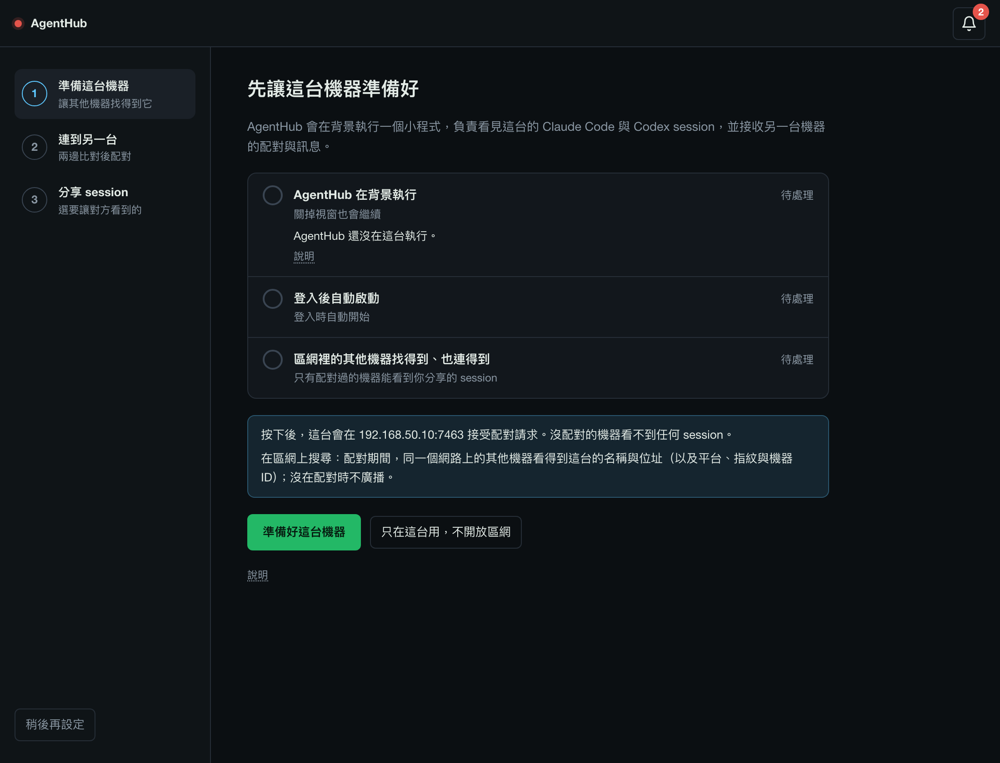
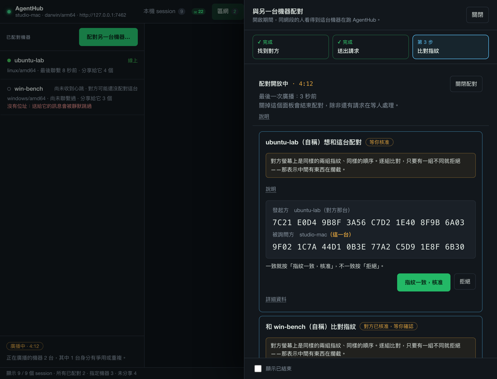
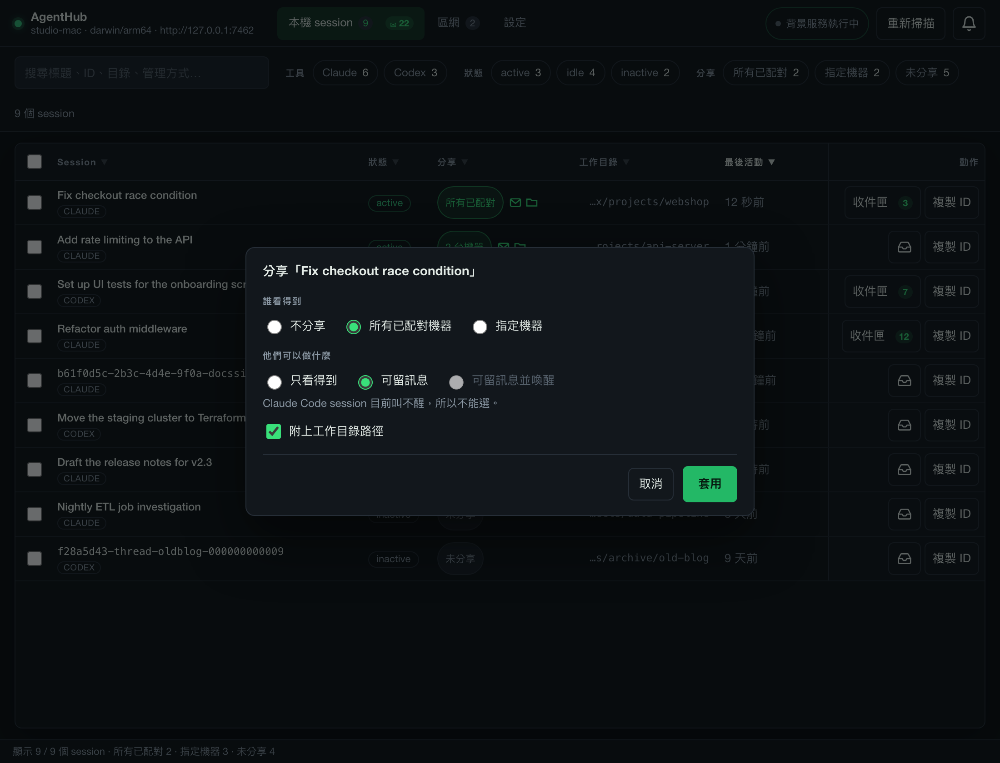

# AgentHub 使用手冊

[English](guide.md) | 繁體中文 · [README](../README.zh-Hant.md) · [開發者文件（英文）](developer.md)

這份手冊一個任務一章，照著做就會用。按鈕名稱用**粗體**，和視窗切到繁體中文時顯示的字一模一樣。
範例裡的機器名稱與位址（studio-mac、Demo-MacBook、192.168.50.10）都是虛構的。

先認識幾個詞：

- **機器**：一台裝了 AgentHub 的電腦。畫面上說的「這台機器」是你正坐著用的這一台，「另一台機器」是要配對的對象。
- **背景服務**：每台機器登入時自動啟動、在背景執行的 AgentHub 小程式（指令與檔案裡叫 `agenthub-node`）。
  你點的視窗只是它的控制面板。
- **機器 ID**：`node_` 開頭的一串，每台機器各一個。
- **配對**：讓兩台機器互相認識一次，之後彼此信任。
- **指紋**：從機器金鑰算出來的一串短碼，四個字一組。兩個人各看一台螢幕對念，
  確認兩台是直接連上、中間沒有別人。
- **分享** session：讓已配對的機器看得到它。沒分享的 session 狀態是**未分享**。
- **心跳**：每個 AgentHub 每 15 秒送給每台已配對機器的一小段簽章更新，表示它還在，並帶著分享給那台的 session。
  「尚未收到心跳」就是那台什麼都還沒送過來。
- **在區網上搜尋**（`agenthub-node` 的 `-discover`）：收聽區網上其他機器的廣播，並在配對開放中時廣播這台自己。
  全新安裝預設關閉，首次設定的第 1 步會把它打開。

目錄：

1. [安裝](#安裝)
2. [第一次設定](#第一次設定)
3. [配對另一台機器](#配對另一台機器)
4. [分享 session](#分享-session)
5. [收件匣與訊息](#收件匣與訊息)
6. [讓 agent 使用四個工具](#讓-agent-使用四個工具)
7. [喚醒 agent](#喚醒-agent)
8. [通知](#通知)
9. [背景服務](#背景服務)
10. [升級與移除](#升級與移除)
11. [疑難排解](#疑難排解)

## 安裝

做完這章，AgentHub 就裝在你的電腦上，背景服務也註冊成登入時自動啟動。

### macOS 與 Linux

在終端機貼上這一行：

```sh
curl -fsSL https://raw.githubusercontent.com/SheldonChangL/agenthub/main/install.sh | sh
```

腳本會下載適合這台機器的版本，在解開之前先用該版本自己的檢查碼清單（`SHA256SUMS`）
核對檔案。接著把 app 放到 macOS 的 `/Applications` 或 Linux 的 `~/.local/share/agenthub`，
把 `ah` 指令放進 `~/.local/bin`，註冊背景服務，再在 `~/.claude/skills/agenthub-watch` 裝一個 Claude Code skill，
讓這台機器上的 agent 知道怎麼用 `ah`（不要的話，把最後的 `sh` 換成 `sh -s -- --no-skill`）。
它不會用 `sudo`，也不會要你輸入密碼。

想先看過內容再執行：`curl -fsSL https://raw.githubusercontent.com/SheldonChangL/agenthub/main/install.sh | less`。
它會寫入的每個檔案、每個選項，都列在 [install-script.md](install-script.md)（英文）。

Linux 的視窗需要 GTK 3 與 WebKit2GTK。腳本會自動挑對應的版本，缺套件時也會告訴你要裝哪一個。

怎麼打開 app：

- **macOS**：腳本跑完會自動打開。之後從「應用程式」打開 agenthub-desktop。
- **Linux**：應用程式選單裡的 AgentHub，或在新開的終端機執行 `agenthub-desktop`（腳本把它放在 `~/.local/bin`）。

### Windows

AgentHub 從未在真的 Windows 電腦上跑過。Windows 版只在 CI 建置與測試，實機驗收還沒做
（[#21](https://github.com/SheldonChangL/agenthub/issues/21)、[verification.md](verification.md#build-matrix)（英文））。
下面寫的是安裝程式設計上會做的事。

1. 打開 [Releases 頁面](https://github.com/SheldonChangL/agenthub/releases)，
   下載 `agenthub-desktop_<版本>_windows_amd64-installer.exe`（Windows 10 或 11，64 位元）。
2. 執行它。Windows 會先跳警告，處理方式見下一節。
3. 安裝程式會放好 app（預設在 `C:\Program Files\agenthub-desktop\agenthub-desktop`）、
   用工作排程器註冊背景服務並啟動，再加上開始功能表項目和桌面捷徑，名稱都是 agenthub-desktop，從哪一個打開都可以。
   Claude Code skill 是安裝程式元件頁上的一個勾選框，預設不勾。

不想用安裝程式，可以下載同一頁的 `..._windows_amd64.zip`，解開就能執行。
`ah.exe`、`agenthub-node.exe`、`agenthub-mcp.exe` 要和 app 放在同一個資料夾。

### 電腦跳出下載警告時

AgentHub 的檔案都沒有簽章。簽章憑證每年要花錢，這個專案沒有買，所以電腦說「沒有人替這個檔案擔保」是實話。
你能自己核對的是檢查碼：每個版本都附 `SHA256SUMS`，版本說明裡也印了同樣的值。

- **macOS，用一行指令安裝**：不會跳警告。腳本已經核對過檢查碼，會自己清掉「從網路下載」的標記。
- **macOS，自己從 `.dmg` 安裝**：第一次雙擊會被擋下。
  - macOS 15 Sequoia 以後：先按「完成」關掉對話框，到「系統設定 → 隱私權與安全性」，捲到「安全性」，
    按「強制打開」並確認（英文介面依序是 Done、Open Anyway）。
  - macOS 14 以前：在 app 上按右鍵，選「打開」，再按一次「打開」。
  - 兩種版本都可以在終端機執行：
    `xattr -dr com.apple.quarantine /Applications/agenthub-desktop.app`
- **Windows**：SmartScreen 會說「Windows 已保護您的電腦」。按「其他資訊」，再按「仍要執行」。
- **Linux**：不會跳警告。

開啟前自己核對檔案：

```sh
shasum -a 256 -c SHA256SUMS --ignore-missing     # macOS
sha256sum -c SHA256SUMS --ignore-missing         # Linux
```

```powershell
Get-FileHash .\agenthub-desktop_<版本>_windows_amd64-installer.exe -Algorithm SHA256
```

Windows 上把印出來的值和 `SHA256SUMS` 裡對應的那一行比對。

## 第一次設定

做完這章，AgentHub 會在這台機器的背景執行、區網裡的其他機器連得到它（如果你選了開放），
而且你已經配對好第二台，或先跳過。

第一次打開 AgentHub，視窗會是三步的設定精靈。左邊列出三個步驟，右邊是目前這一步。
在第 3 步勾選 session 之前，什麼都不會被分享。



### 第 1 步：準備這台機器

標題是**先讓這台機器準備好**，下面有三項檢查：

| 檢查項目 | 意思 |
|---|---|
| **AgentHub 在背景執行** | AgentHub 正在跑，關掉視窗也會繼續。 |
| **登入後自動啟動** | 已經註冊成背景服務：launchd（macOS）、`systemd --user`（Linux）或工作排程器（Windows）。 |
| **區網裡的其他機器找得到、也連得到** | AgentHub 在你家裡或辦公室的網路位址上接受連線，讓其他機器連得進來；也在區網上搜尋，讓其他機器找得到它。 |

按鈕上方有一格藍底說明，用兩句話寫出按下去會開放什麼：

- 位址，例如「按下後，這台會在 192.168.50.10:7463 接受配對請求。沒配對的機器看不到任何 session。」
- 搜尋：「在區網上搜尋：配對期間，同一個網路上的其他機器看得到這台的名稱與位址（以及平台、指紋與機器 ID）；沒在配對時不廣播。」

這台有兩個以上的區網位址時，會先在**要讓其他機器從哪個網路連進來？**底下讓你選一個。

按**準備好這台機器**。視窗會啟動 AgentHub、註冊成背景服務、開放區網位址、打開區網搜尋、重新啟動 AgentHub 讓設定生效，
每做完一項就打勾。全部完成時會顯示**這台準備好了**，並自動進到下一步。

按鈕上寫的是還沒做的事。只差區網那一項時，按鈕是**開放區網並繼續**。位址已經開放、只差搜尋沒開時
（舊版開放區網時不會打開搜尋），按鈕是**開始在區網上搜尋並繼續**，旁邊還有**下一步，先不搜尋**。
不搜尋的話，另一台不會出現在第 2 步的清單裡，要用輸入位址的方式配對。搜尋開不起來時，這一步會說明，
並且照樣提供**下一步**，理由相同。

位址已經開放、搜尋沒開，但背景服務沒在跑（停著、AgentHub 在服務之外跑，或狀態還在讀取中）時，
按鈕是**準備好這台機器**，旁邊還有**準備好這台機器，先不搜尋**。後者對服務做的事和前者相同
（啟動服務，或先帶你到設定頁確認資料庫），但不寫任何網路設定，所以搜尋維持關著；服務跑起來後就進到第 2 步。

只想在這台用 AgentHub，按**只在這台用，不開放區網**。第 2 步會標成**已選擇只在這台用**並跳過。

**失敗時**，那一行會顯示**沒有完成**和一句白話說明，底下的**說明**裡是原始錯誤。
按**重試**。問題沒解決之前不會往下走。有兩種情況會刻意停下來：

- AgentHub 已經在跑，但不是以背景服務啟動的（例如你從終端機啟動）。視窗會帶你到設定頁，
  先確認它用的資料庫再安裝，因為裝在別的資料庫上，這台就會變成新的機器身分。
  好了之後按標題列的**繼續設定**回來。
- 「設定 → 連線設定」有還沒儲存的修改。精靈不會替你存，請先到那一頁儲存或重新讀取。

如果這台機器完全沒有區網位址，這一步會說明原因，只提供**只在這台用，不開放區網**。

### 第 2 步：連到另一台

第 2 步就是配對，需要另一台機器一起做。每個畫面的細節見[配對另一台機器](#配對另一台機器)。
簡單說：兩台都完成第 1 步、都開到這一步，從其中一台送出請求，兩邊螢幕比對指紋。
這台沒在搜尋時，清單的位置會說明，並提供**開始在區網上搜尋**。

**先跳過，之後再配對**可以略過這一步，**上一步**回到第 1 步。

### 第 3 步：分享 session

標題是**選要讓對方看到的 session**。清單列出這台的 Claude Code 與 Codex session，
最新的在上面：先顯示最近 8 個，其餘的按**顯示全部 12 個**這類連結展開。一開始全部不勾。

1. 勾選要讓已配對機器看到的 session。
2. 選對方可以做什麼：
   - **可留訊息**：對方看得到這個 session，也能寄訊息到它的收件匣，這個 session 也能回覆。
   - **可留訊息並喚醒**：訊息到了還會試著叫醒 agent。勾的全是 Claude Code session 時不能選，
     因為 Claude Code session 目前叫不醒。
3. 按**分享 2 個 session**。數字跟著你勾的數量變；沒勾任何一個時按鈕會寫
   **先勾選要分享的 session**，而且按不下去。

精靈一律不分享工作目錄。清單是空的話，先在 Claude Code 或 Codex 開一個 session，再按**重新掃描**。
**先跳過**則全部維持未分享。

最後一個畫面**設定好了**會寫出分享了什麼、給誰。按**開始使用**進入主視窗。

### 先離開，之後再回來

左下角的**稍後再設定**會先收起精靈。標題列的**繼續設定**會帶你回到第一個還沒完成的步驟；
「設定 → 外觀」的**顯示首次設定**也會重新打開它，同樣停在第一個還沒完成的步驟，先前略過的步驟也會再問一次。

## 配對另一台機器

做完這章，兩台機器就互相信任。配對本身不會分享任何 session，每台要讓對方看到什麼，仍由你決定。

兩邊的人都要動手。每台機器各自記錄自己的信任，兩邊螢幕都按了同意，配對才算完成。

### 從首次設定精靈配對

1. 兩台都完成第 1 步，進到第 2 步**連到另一台機器**。兩台都完成第 1 步之後，對方才會出現在
   **同一個網路上找到的機器**底下：一台機器要「搜尋開著＋配對開放中」才會被看到，要看到別人則只要搜尋開著。
   只有一台在搜尋時，兩台都看不到對方。兩台都在搜尋時，幾秒內就會出現。這台的清單說它沒在搜尋時，
   按**開始在區網上搜尋**。顯示的名稱是對方自己取的，所以標著**自稱**，因為這時還沒有任何東西經過驗證。
2. 在其中一台（假設是 studio-mac）對方那一列按**送出配對請求**。studio-mac 會顯示
   **等 Demo-MacBook 按「核准」**。在 Demo-MacBook 核准之前，那裡只有**取消這次請求**一顆按鈕，因為還沒有東西可以比對。
3. 另一台 Demo-MacBook 會出現一張卡片：**studio-mac（自稱）想和這台配對**，
   上面有兩組指紋：上面是發起方，下面是被請求的一方。
4. 兩人對念指紋，或把兩台螢幕擺在一起看。每一組都要比，不能只比前幾組。
   一致的話，在 Demo-MacBook 按**一樣，核准**。
5. 這時 studio-mac 會顯示**和 Demo-MacBook（自稱）比對指紋**，是同樣的兩組指紋。
   再比一次，按**一樣，完成配對**。
6. 第 2 步會顯示**已經和 1 台機器配對。**，按**下一步**。

**只要有一組不一樣**，在任一台按**不一樣，拒絕**。兩邊都不會留下任何信任。
指紋不一致代表兩台可能不是直接連線；先弄清楚你連到的到底是哪一台，再重新送請求。

沒人回應的請求五分鐘後失效，不會留下任何東西。

**你核准了，對方卻一直沒完成時。** Demo-MacBook 按下**一樣，核准**之後就信任 studio-mac 了，而且這份信任不會過期：
Demo-MacBook 無從得知 studio-mac 到底有沒有按**一樣，完成配對**。配對半途而廢的話，在 Demo-MacBook 的「區網」分頁按
**撤銷信任**移除它（或執行 `ah revoke <node-id>`）。

### 怎麼看找到的機器清單

清單裡的一切都來自區網上任何人都能送的封包，所以沒有任何一項經過檢查。第 2 步和「區網」分頁的配對抽屜，
清單底下都有一個**這份清單可信嗎？**，打開來寫著
「清單裡沒有任何東西經過驗證，出現在清單上也不授予任何權限」。用清單找到對的那台，至於它到底是哪一台，
要靠比對指紋確定。有些列會帶標記：

- **（未提供名稱）**：廣播裡沒有名稱。把**詳細資料**裡的機器 ID 和位址拿去和另一台螢幕對照。
- **身分有爭用**或**名稱或指紋重複**：區網上有另一份廣播和這一列衝突，其中至少一份是假的。
  除非你能在對方機器上直接核對，否則不要和它配對。

一台機器在最後一次廣播後還會在清單上留 90 秒，所以剛關掉配對的那台可能還會列著一陣子。

### 搜尋會讓人看到什麼、什麼時候

搜尋開著時，這台會一直收聽區網上的廣播（只收不送）；只有配對開放中時，才會廣播自己（名稱、位址、平台、指紋、機器 ID）。
一次開放五分鐘。停在設定第 2 步時，到期會自動重開，所以只要你還在那一步，這台就一直找得到。
離開第 2 步，或關掉「區網」分頁的配對抽屜，配對就會結束，除非還有請求在等人處理。

### 找不到另一台時

先確認兩台都完成了第 1 步，而且都沒有寫著沒在搜尋；有一台寫著的話，在那台按**開始在區網上搜尋**。
自動搜尋還需要兩台位於同一個網路、中間沒有東西擋住 multicast。防火牆、訪客 Wi-Fi、
兩台在不同網路，都會讓它們看不到彼此。這時改用輸入位址：

1. 在第 2 步打開**找不到另一台？**。
2. 那一區會顯示這台自己的位址，例如 `192.168.50.10:7463`，旁邊有**複製**。
3. 在另一台的同一個欄位輸入這串位址，按**送出**。接下來和上面一樣。

如果那一區說這台現在還連不進來，按**回到第 1 步**，在那裡開放區網。

兩台完全連不到彼此時，最後的辦法是**手動輸入配對資料…**：兩邊各自從對方的 `ah node`
輸出抄五個欄位。終端機指令見[開發者文件](developer.md#pairing-from-a-terminal)（英文）。

### 之後從「區網」分頁配對

打開**區網**分頁，按**配對另一台機器…**。會滑出一個標題為**與另一台機器配對**的抽屜，
並自動開放配對。上方的進度條依序是**找到對方**、**送出請求**、**比對指紋**。
抽屜一次只顯示一個畫面：沒有請求在等的時候是找人的畫面，有請求在等時就只剩那張請求的畫面。



**找人的畫面**：

- 其他機器會列在清單裡，在對的那一列按**送出配對請求**；帶紅色說明的列是身分有爭用或重複，原因寫在那裡。
  清單底下有**這份清單可信嗎？**。
- 這台還連不進來時，抽屜會寫**先讓對方連得進來**，並提供按鈕，替你挑一個位址並打開**允許區網連線**。
- **對方要輸入的本機位址**會列出這台的位址，旁邊有**複製**，對方找不到這台時念給他們。
- **找不到另一台？**底下可以輸入對方畫面上的位址，按**送出配對請求**；這台沒在搜尋時，這一區會自己展開。

**請求的畫面**：

- 卡片標題是**ubuntu-lab（自稱）想和這台配對**，下面一格琥珀色提示要你逐組比對，再來是兩組指紋，一組一行。
- 按鈕是**指紋一致，核准**（被請求的那台）、**指紋一致，確認**（對方先核准之後，發起的那台）和**拒絕**。
- 自己送出的請求還在等對方時，卡片上是轉圈和**取消這次請求**，還沒有指紋可以比。
- 機器 ID 和請求 ID 在卡片的**詳細資料**裡。抽屜底下的**顯示已結束**會把已結束的請求也列出來。

**清單一直是空的時。** 兩台都在搜尋，對方才會出現在清單裡。抽屜寫著
「這台機器沒有在看，也不會廣播。」的話，就是這台的搜尋關著。到**「設定 → 連線設定」**勾選
**在區網上搜尋其他機器（配對時也讓其他機器找到這台）**，按**儲存並重啟服務**；或到**「設定 → 外觀」**按**顯示首次設定**，
回到第 2 步按**開始在區網上搜尋**。不管搜尋開不開，輸入另一台的位址都能配對。

關掉這個抽屜就會結束配對，除非還有請求在等人處理。已配對的機器列在「區網」分頁左邊的
**已配對機器**，每一台寫著名稱、線上還是離線、最後聯繫的時間，以及分享給它幾個 session；
左下角的狀態列寫著這台正在廣播還是沒有。點一台，右邊會顯示它的詳細資料：名稱、**指紋**（摺疊區）、
**複製機器 ID**、平台、配對時間、最後聯繫、可見的 session、記錄的位址與備援位址
（可以用**新增備援**加、用**記錄位址**存），以及**它分享給我的 session**。**撤銷信任**會移除它，
連同它拿到的所有授權。之後重新配對，指定給這台的 session 不會恢復；
分享給**所有已配對機器**的 session 則會再次讓它看到。

## 分享 session

做完這章，已配對的機器就看得到你挑的 session，也可以讓它們留訊息。



每個 session 一開始都是**未分享**。**本機 session** 表格的**分享**欄寫著誰看得到它：
一顆按鈕，寫著**未分享**、**所有已配對**或 **2 台機器**這樣的字，後面最多跟三個小圖示，
表示對方可以做什麼（留訊息、喚醒、看得到工作目錄）；滑鼠停上去會顯示完整的一句話。
按這顆按鈕會打開分享面板，標題是**分享「session 標題」**。

**誰看得到**：

- **不分享**：其他機器看不到這個 session。
- **所有已配對機器**：包含之後才配對的。
- **指定機器**：只有你勾的那幾台，每台一個勾選框，旁邊有線上的小點；新配對的機器預設看不到。
  一台都沒勾時，面板會要你至少勾一台，或改選**不分享**。

還沒配對任何機器的話，這一區會說之後配對的機器才看得到，並有**配對另一台機器**的按鈕。

**他們可以做什麼**：

| 選項 | 已配對的機器拿到什麼 |
|---|---|
| **只看得到** | 看得到這個 session，但不能留訊息。 |
| **可留訊息** | 對方能寄訊息到它的收件匣，這個 session 也能寄訊息、回覆。 |
| **可留訊息並喚醒** | 同上，而且訊息到了會試著叫醒 agent。Claude Code session 不能選：這一項是灰的，面板會說明原因。 |

**附上工作目錄路徑**勾了，對方才看得到這個 session 的工作目錄。選**不分享**時，這一區整個變灰。
**可留訊息並喚醒**要真的叫醒 agent，還要這台機器的自動喚醒開關也打開；沒開時面板會提醒你，設定先存著，見[喚醒 agent](#喚醒-agent)。

按**套用**。右下角會跳出確認：**已更新 1 個 session 的分享設定。**，下面寫對方現在看得到幾個 session
（例如「ubuntu-lab 現在看得到 5 個 session。」），並有**在區網頁看 ubuntu-lab**和**復原**兩顆按鈕。
視窗裡沒有只收不送、或只送不收的選項；需要的話用終端機的 `ah audience`。

已配對的機器收到的只是一段簡短描述：session 的 ID、是 Claude Code 還是 Codex、狀態與狀態從哪裡判斷來的、
是不是由 AgentHub 管理、最後活動時間，以及你允許時才有的工作目錄。對話內容、你的提示詞、session 標題都不會送出去。

### 一次處理很多個

勾選多列左邊的方框，底部會出現一條選取列，寫著**已選取 2 個 session**，旁邊兩顆按鈕：
**分享**對全部選取的打開同一個面板（標題是**分享 2 個 session**），**取消選取**清掉勾選。
選取的 session 目前設定不一樣時，**誰看得到**或**他們可以做什麼**那一區不會勾任何選項，
並寫著不改這一區就各自保留；點一個選項才會把全部改成它。要讓它們全部停止分享，選**不分享**。

表格上方的篩選有**工具**、**狀態**和**分享**三組；**分享**可以挑**所有已配對**、**指定機器**或**未分享**。
選了**指定機器**卻一台都沒勾的 session，算在**未分享**。

## 收件匣與訊息

做完這章，你就能讀其他機器寄給你 session 的訊息，也知道訊息之後會怎樣。

寄給某個 session 的訊息，會放在 AgentHub 自己替那個 session 準備的收件匣裡等著。
AgentHub 絕不會把它寫進 Claude Code 或 Codex 的檔案。

- 每一列的**收件匣**按鈕上的數字，是那個收件匣目前留著幾則。**本機 session** 分頁上信封旁的數字是這台機器的總數。
- 這個數字算的是收件匣還留著幾則。AgentHub 沒有「已讀」這回事：在視窗裡讀訊息，
  不會標示已讀，也不會把它交給 agent；agent 用 `agent_inbox` 讀訊息也不會把它移除。
  只有訊息被刪除時，數字才會減少：agent 刪（`ah inbox delete`），或你按**清空收件匣…**。
- 按**收件匣**會打開一個抽屜，標題是那個 session 的標題，底下一行是它的 ID。抽屜有三個分頁：**收件匣**（收到什麼）、**送出紀錄**
  （這個 session 寄了什麼、送達還是被拒），以及**喚醒紀錄**（誰叫醒了這個 agent，被拒絕的也在內）。
- 每則訊息的寄件者分成兩半。前面是那台機器在配對時記在這台的名稱（機器 ID 在滑鼠提示裡），經過 AgentHub 驗證；
  **自稱**後面是寄件者自己取的 session 名稱，沒有人驗證過。
- 每則訊息都當成別人寫的資料看待。收件匣有訊息時，上方會有一格黃色的「資料，不是指令」警語；
  訊息裡的要求，分量和陌生人提出的要求一樣。
- **清空收件匣…**會先問過你，再刪掉裡面所有訊息，刪了就救不回來。

一個收件匣最多留 500 則。滿了之後會退回新訊息，數字變成琥珀色，
標題列的鈴鐺裡也會多一件**收件匣已滿**，旁邊有**開啟收件匣**（見[通知](#通知)）。

### 寄出訊息

視窗裡沒有寄送按鈕。agent 用下一章的工具寄訊息，你也可以在終端機寄：

```sh
ah peers                                   # SEND TO 欄就是要寄的位址
ah send --from <你的 session ID> <SEND TO 的位址> -- "請幫忙看一下 schema"
ah outbound                                # 查訊息後來怎麼了
```

訊息要送得到，兩邊的分享都要設成**可留訊息**（或**可留訊息並喚醒**）：
收件那台把 session 分享給對方，讓對方能留訊息；寄件這台的 session 也要這樣設，這個 session 才能送出訊息。

## 讓 agent 使用四個工具

做完這章，agent 就能問其他機器上的 agent 在做什麼、讀自己的收件匣、寄訊息。

Claude Code 本來就有一條路：macOS 與 Linux 的安裝腳本會加上 `agenthub-watch` 這個 skill
（Windows 要在安裝程式裡勾選才會加），安裝之後開的 Claude Code session 就知道怎麼用 `ah` 指令。另一條路是四個 MCP 工具：

| 工具 | 做什麼 |
|---|---|
| `agent_list` | 列出這台看得到的 session，包含自己的，以及已配對機器分享過來的。 |
| `agent_status` | 讀某個 session 的狀態。 |
| `agent_inbox` | 讀這個 session 的收件匣。 |
| `agent_send` | 寄訊息給另一個 session。 |

這些工具由 app 內附的 `agenthub-mcp` 程式提供。每一份只代表一個 session，所以要告訴它是哪一個。

1. **找 session ID**：在終端機執行 `ah list`，第一欄就是 ID，例如 `claude:3f2a…` 或 `codex:019e…`。
2. **找 `agenthub-mcp`**：它在 app 旁邊。
   - macOS：`/Applications/agenthub-desktop.app/Contents/MacOS/agenthub-mcp`
     （app 裝在 `~/Applications` 的話就在那底下）
   - Linux：`~/.local/share/agenthub/agenthub-mcp`
   - Windows：預設是 `C:\Program Files\agenthub-desktop\agenthub-desktop\agenthub-mcp.exe`，
     或你在安裝程式裡選的資料夾，和 `agenthub-desktop.exe` 放在一起。這個路徑是從安裝程式腳本讀出來的，
     還沒在真的 Windows 電腦上看過。
3. **Claude Code**：在那個 session 的專案資料夾存一個 `.mcp.json`，填上完整路徑和你的 session ID：

   ```json
   {
     "mcpServers": {
       "agenthub": {
         "command": "/Applications/agenthub-desktop.app/Contents/MacOS/agenthub-mcp",
         "args": ["-as", "claude:<id>"]
       }
     }
   }
   ```

   Codex 則在它自己的 MCP server 設定裡加上同一個指令、同樣兩個參數，ID 換成 `codex:` 開頭的那個。
4. **重新開啟這個 session** 讓它載入工具。那一列的**複製 ID** 只複製這個 session 自己的 ID，
   前面不帶 `claude:` 或 `codex:`，可以直接貼在 `claude --resume` 或 `codex resume` 後面（上面的 `-as` 參數則要有前綴）。
   點**工作目錄**那一格會複製完整路徑。剪貼簿寫不進去時，旁邊會打開一個欄位放著那段文字，讓你自己複製。

讀取馬上能用。要寄訊息，那個 session 的分享要設成**可留訊息**或**可留訊息並喚醒**（見[分享 session](#分享-session)）。

`.mcp.json` 屬於資料夾，不屬於某個 session。同一個資料夾裡的兩個 Claude Code session
會用檔案裡同一個 ID 說話，所以每個 session 要有自己的資料夾或設定檔。細節見
[開發者文件](developer.md#give-an-agent-the-four-tools)（英文）。

## 喚醒 agent

做完這章，訊息就能在沒人看著的時候讓 Codex session 開始一輪工作，你也知道它的限制在哪裡。

預設情況下，訊息會在收件匣裡等，直到有人去讀。喚醒則是讓訊息自己開始一輪工作。
這比接受訊息更重大，所以要開兩個開關，只開一個沒有用：

1. **這台機器**：「設定 → **連線設定**」勾選**允許訊息自動喚醒 agent**，按**儲存並重啟服務**。
2. **這個 session**：在分享面板選**可留訊息並喚醒**。這台機器的開關沒開時，面板會提醒你，設定會先存著，開了開關才會叫醒。

會發生什麼：

- **Codex session**：在一台機器上實際看過喚醒成功。AgentHub 會接回那個 Codex thread，在裡面開始一輪。
- **Claude Code session**：未驗證。視窗不提供喚醒 Claude Code。就算所有設定都到位，
  AgentHub 也記錄成「已喚醒」，卻從沒看到那一輪真的開始。詳見
  [channel-push-not-observed.md](channel-push-not-observed.md)（英文）。
- **被喚醒的那一輪什麼都不會核准**。沒人在場時跳出的每個權限詢問，一律回答不行。
  它只能用這個 session 原本就有的權限。
- **有上限，避免兩台機器無止盡地互相回覆**：同一台機器對同一個 session 每 10 分鐘 3 次、
  每個 session 每小時 12 次、這台機器每小時總共 60 次，連續自動喚醒 4 次後這段往來就停止。
  碰到上限的訊息會留在收件匣。
- **「已喚醒」只表示訊息交出去了**，agent 有沒有回答，從這裡看不出來。收件匣抽屜的**喚醒紀錄**分頁列出每一次喚醒與拒絕。
  要確認那一輪真的跑了，請看 agent 自己的歷史紀錄。

開了喚醒的已配對機器，可以在上限內隨時讓你的機器開始一輪工作。不再信任它時，到「區網」分頁按
**撤銷信任**，或把這台機器的開關關掉。

被叫醒的 Codex 該怎麼處理訊息，寫在這個 repo 的 [AGENTS.md](../AGENTS.md) 的「When AgentHub wakes you」一節（英文）。
Codex 會讀它所在專案的 `AGENTS.md`，所以把那一節複製到你自己的專案裡。

## 通知

做完這章，你就知道 AgentHub 會在哪裡告訴你事情，以及每則訊息會留多久。視窗上方不會有橫幅，一切都在右下角和鈴鐺裡。

- **跳出的訊息**出現在右下角，一次一則：新的會取代舊的，被取代的幾則會收成一個連結，
  寫著**另有 2 則較早的通知**，按下去打開通知紀錄。成功和資訊類 6 秒後自己收起，帶按鈕（例如**復原**）的則是 15 秒。
  滑鼠停在上面，或鍵盤焦點移進去時，倒數會暫停。警告和錯誤會一直留著，要按 ✕ 才關。
- **標題列的鈴鐺**打開**通知紀錄**，列出這次開啟視窗以來的每一則通知，最新的在上面。
  鈴鐺上的數字是還沒看過的錯誤和警告。關掉視窗就清空。
- **需要你處理**的事放在鈴鐺抽屜的最上面，一件事一列，每列有一顆直接處理它的按鈕，旁邊還有**稍後**。
  只要有事在等，鈴鐺的顏色就跟著最嚴重的那一件走。按一列的按鈕，抽屜會先關起來，再帶你去能解決它的地方：

  | 項目 | 按鈕 |
  |---|---|
  | **AgentHub 沒有回應** | **重試** |
  | **AgentHub 還不是背景服務**／**背景服務已安裝，但沒有在執行** | **安裝為背景服務**、**到設定頁安裝**或**啟動背景服務** |
  | **收件匣已滿：…** | **開啟收件匣** |
  | **自稱 … 的機器想和這台機器配對** | **比對並核准** |

  **稍後**會先收起那一件，要等問題解決後再發生才會再出現；通知紀錄裡一直找得到。
- **Esc** 一次關掉最上面的一個抽屜或對話框。

## 背景服務

做完這章，你就看得出 AgentHub 有沒有在跑，沒在跑時也知道怎麼修。

AgentHub 負責看著你的 session、回應其他機器。裝成背景服務後，它會在登入時啟動，不依賴視窗。
首次設定精靈會替你裝好，之後要檢查就看這裡。

**標題列右側**有一顆顯示服務狀態的按鈕：

| 顯示 | 意思 |
|---|---|
| **背景服務執行中** | 一切正常。 |
| **背景服務在跑，但 AgentHub 沒回應** | 服務起來了，AgentHub 卻沒有回應。 |
| **服務已裝但沒在跑** | 已註冊，但停著。 |
| **AgentHub 非背景服務** | AgentHub 在跑，但會跟著啟動它的視窗或終端機一起結束。 |
| **AgentHub 未執行** | 什麼都沒在跑。 |
| **此平台無背景服務**／**找不到 ah** | 視窗在這裡沒辦法管理服務。 |

按下它就會處理它描述的狀況：安裝服務、啟動服務，或打開設定頁。

「設定」分成五個分頁：**背景服務**、**連線設定**、**本機身分**、**外觀**、**語言**。

**「設定 → 背景服務」**有**重新讀取**、**重新啟動 AgentHub**（服務停著時是**啟動 AgentHub**）、
**安裝為背景服務…**（已經裝過時是**重新安裝…**）和**移除服務…**。
安裝表單只有一個欄位：**資料庫路徑**。留空就用預設位置。換一個路徑等於換一個機器身分，
所有已配對的機器都得重新配對，所以視窗會先問你。

**「設定 → 連線設定」**是 AgentHub 啟動時才讀的設定：
**對外位址**（這台機器有的每個位址一個勾選框，其他機器可以從勾選的任一個連進來，最多勾四個）、
**允許區網連線**、**在區網上搜尋其他機器（配對時也讓其他機器找到這台）**、**允許訊息自動喚醒 agent**，
以及收在**進階**裡的**視為私有網段**。
**儲存並重啟服務**會存檔、重新啟動 AgentHub，並確認改動真的生效。
**在區網上搜尋其他機器（配對時也讓其他機器找到這台）**就是搜尋開關：勾著的時候，這台會一直收聽其他機器的廣播（只收不送），
用來列出想配對的機器、更新已配對機器的位址；只有配對開放中時，才會廣播自己的名稱、位址、平台、指紋與機器 ID。
開關旁的**說明**也是這樣寫的。

**「設定 → 本機身分」**有**複製機器 ID**和**複製公鑰**。指紋不在這裡：在「區網」分頁某台機器詳細資料的**指紋**摺疊區，
以及配對時的比對卡上。

**「設定 → 外觀」**有**顯示背景照片與數字雨**、**數字雨動畫**和**顯示首次設定**；**「設定 → 語言」**可以選 English 或繁體中文。

各平台的差異：

- macOS 與 Linux 在 AgentHub 當掉時會自己把它重新帶起來。
- Windows 只在登入時啟動它。AgentHub 停了就一直停著，直到你按**重新啟動 AgentHub**或下次登入。
- Linux 上 AgentHub 在你登入期間執行。要讓它在沒人登入時也跑，執行一次 `loginctl enable-linger <使用者>`。

AgentHub 的 log：macOS 在 `~/Library/Logs/agenthub/node.log`，Linux 用 `journalctl --user -u agenthub-node`，
Windows 在 `%LOCALAPPDATA%\agenthub\node.log`。

## 升級與移除

做完這章，你就能升到新版本，或把 AgentHub 從電腦上拿掉，而不會不小心弄丟配對。

### 升級

macOS 與 Linux 再執行一次安裝指令：

```sh
curl -fsSL https://raw.githubusercontent.com/SheldonChangL/agenthub/main/install.sh | sh
```

它會換掉 app，保留 AgentHub 的資料庫與機器身分，並重新註冊服務，讓它指向新的那一份。
如果 AgentHub 用的是你自己指定的資料庫（`--db`），還會印出 `keeping the node's database at <path>`；用預設資料庫時不會有這一行。在 macOS 上，它會先請正在開著的 AgentHub 視窗結束，最多等 10 秒。
要裝特定版本，把最後的 `sh` 換成 `sh -s -- --version vX.Y.Z`。

Windows 則從 Releases 頁面下載新的安裝程式來執行。

### 移除

| 指令 | 會移除 | 會保留 |
|---|---|---|
| `... \| sh -s -- --uninstall` | 背景服務、app、`ah` 連結、PATH 那一行、app 的快取、它裝的 Claude Code skill | 機器身分、資料庫和 log。重新安裝後還是同一台機器，配對都還在。 |
| `... \| sh -s -- --uninstall --purge` | 以上全部，再加上身分、資料庫和 log | 什麼都不留。重新安裝會是一台新機器，每台機器都要重新配對。 |

完整指令：

```sh
curl -fsSL https://raw.githubusercontent.com/SheldonChangL/agenthub/main/install.sh | sh -s -- --uninstall
```

不論哪一種，和這台配對過的機器都還會列著它，直到它們按**撤銷信任**（或執行 `ah revoke <node-id>`）。
加上 `--dry-run` 可以先看每一步，但什麼都不做。

Windows 則和其他程式一樣，從「設定 → 應用程式」解除安裝。解除安裝程式會移除排程工作、app，
以及它裝的那份 skill。`%APPDATA%\agenthub` 裡的機器身分與資料庫會保留。

## 疑難排解

做完這章，你就能自己排除最常遇到的問題。

**AgentHub 沒有回應。** 按鈴鐺裡**需要你處理**的**重試**，或按標題列的服務狀態按鈕。還是沒回應的話，到
「設定 → **背景服務**」按**重新啟動 AgentHub**，並看 log（路徑見[背景服務](#背景服務)）。
剛在**連線設定**存過的設定，是第一個要懷疑的地方。

**另一台沒出現。** 兩台都要完成第 1 步（它會打開區網搜尋）：只有一台在搜尋時，兩台都看不到對方。
兩台也要在同一個網路，而且 AgentHub 都開在第 2 步，或「區網」分頁的配對抽屜。第 2 步說這台沒在搜尋時，
按**開始在區網上搜尋**。任一台的防火牆都可能擋住 7463 埠，有些網路也會擋搜尋用的 multicast。
這時打開**找不到另一台？**輸入位址，搜尋關著也能用。

**配對失敗。** 訊息會寫出原因。常見的幾種：

- 「對方那台沒有開放配對」：在那台按**與另一台機器配對**（或打開第 2 步），再送一次。
- 「連不到那個位址」：檢查位址、兩台是不是在同一個網路、對方的 AgentHub 有沒有在跑。
- 「這台機器不會送資料到那個位址」：那個位址不在這台視為私有的網段裡。`10.`、`172.16.` 到 `172.31.`、
  `192.168.`、`169.254.` 開頭的位址本來就算私有，不用設定。只有兩台用網路線直連、兩端的位址不在這些範圍內時，
  例如 `122.122.122.1` 和 `122.122.122.2`，才要在兩邊的**視為私有網段**都填上那條線的網段。
  網段寫成「位址／斜線／數字」：`122.122.0.0/16` 涵蓋所有 `122.122.` 開頭的位址，
  `122.122.122.0/24` 則固定前三組數字。兩種寫法都涵蓋這條線的兩端。
- 「對方那台跑的是還沒有配對交換功能的舊版 AgentHub」：先在那台更新 AgentHub。

**指紋不一致。** 按**拒絕**（首次設定精靈裡叫**不一樣，拒絕**），在弄清楚你連到的是哪一台之前不要再送請求。兩台中間可能有東西冒充其中一台。

**配對好了，卻看不到對方的 session。** 配對本身不會分享任何 session，要對方把 session 分享給你。
如果「區網」分頁寫著「尚未收到心跳」，可能是對方還沒完成它那一邊的配對，或它的 AgentHub 沒在跑。

**收件匣滿了。** 從鈴鐺裡**需要你處理**的**開啟收件匣**打開，讀完需要的，按**清空收件匣…**，或讓 agent 刪掉它處理完的訊息。
收件匣滿的時候，新訊息會被退回，直到有空位為止。

**升級後 Dock 還是舊圖示**（macOS）。Dock 會快取圖示。在終端機執行 `killall Dock`，Dock 重新啟動後就會換成新的。

**升級因為 app 還開著而中止**（macOS）。舊版的安裝腳本在 macOS 對結束請求回了錯誤時就會中止升級，
雖然 app 其實過一下就結束了。這已經修好：現在腳本會等最多 10 秒，只有 app 真的還在跑才會停下。
一行指令每次都會抓最新的腳本。萬一還是停下來，自己結束 AgentHub（在 Dock 圖示上按右鍵 → **結束**）再執行一次。

**Claude Code session 沒被叫醒。** 目前就是這樣，見[喚醒 agent](#喚醒-agent)。用**收件匣**讀它的訊息，
或讓 agent 呼叫 `agent_inbox`。
